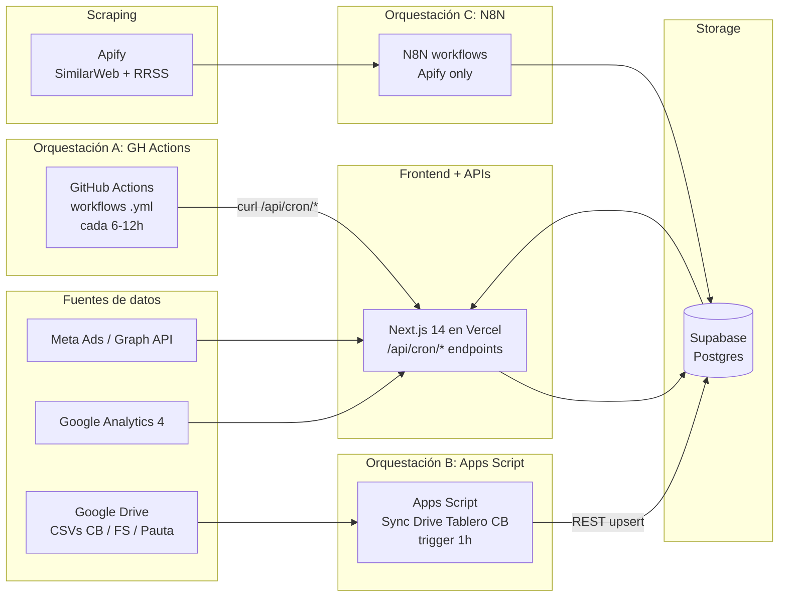

# Dashboard Mkt

Dashboard unificado de monitoreo de campañas digitales y offline. Consolida
Google Ads, Meta Ads, GA4 y canales offline, compara performance real vs
planning, visualiza el funnel completo (impresiones → clicks → sesiones →
conversiones) e incorpora inteligencia competitiva (web + redes sociales).

> Estado: app desplegada en Vercel con datos reales. Tres orquestadores:
>
> - **GitHub Actions** dispara los endpoints `/api/cron/*` del Next app para
>   GA4, Meta (orgánico FB/IG), paid creatives, sentiment, organic insights.
>   Ver [`docs/crons-github-actions.md`](docs/crons-github-actions.md).
> - **Apps Script "Sync Drive Tablero CB"** lee folders de Drive (CSVs de
>   Cuadros Básicos, Floor Share y Planning de Pauta) y los upsertea a
>   Supabase. Sin OAuth tokens — corre con la cuenta Google del dueño del
>   script. Ver [`docs/planning-media-sync.md`](docs/planning-media-sync.md).
> - **N8N** queda solo para Apify (scraping de competidores web/social).

---

## Arquitectura



Los crons de APIs (Meta FB/IG/paid, GA4, sentiment, organic-insights) viven
en `.github/workflows/` y disparan endpoints `/api/cron/*` — detalle en
[`docs/crons-github-actions.md`](docs/crons-github-actions.md).

Los syncs de archivos de Drive (Cuadros Básicos, Floor Share, Planning de
Pauta) viven en el Apps Script "Sync Drive Tablero CB" que se ejecuta cada
hora — detalle en [`docs/planning-media-sync.md`](docs/planning-media-sync.md).

**Stack**

- **Storage**: Supabase (Postgres 15)
- **Frontend**: Next.js 14 App Router + TypeScript + Tailwind + shadcn/ui
- **Visualización**: Recharts
- **Orquestación**: GitHub Actions (APIs) + Google Apps Script (Drive→Supabase) + N8N (Apify)
- **Scraping**: Apify actors (competencia web/social) vía N8N
- **Hosting**: Vercel (frontend) + Supabase (DB) + Apps Script (Google nativo) + N8N self-hosted/cloud

---

## Estructura del repo

```
dashboard-mkt/
├── apps/
│   └── web/                  # Next.js (frontend)
├── packages/
│   ├── db/                   # Cliente Supabase + tipos
│   └── shared/               # Tipos y utils compartidos
├── supabase/
│   ├── migrations/           # SQL versionado
│   └── seed/                 # Data de prueba
├── n8n-workflows/            # JSON exports versionados (fase 2)
└── docs/                     # Documentación adicional
```

---

## Setup local

### 1. Pre-requisitos

- **Node.js 20+** y **pnpm 9+** (`npm i -g pnpm`)
- Cuenta gratis en [supabase.com](https://supabase.com)
- Cuenta gratis en [github.com](https://github.com) (para hostear el repo)
- (Opcional fase 2) Cuenta en [vercel.com](https://vercel.com) para desplegar

### 2. Clonar e instalar

```bash
git clone https://github.com/<tu-usuario>/dashboard-mkt.git
cd dashboard-mkt
pnpm install
```

### 3. Crear el proyecto Supabase

Ver guía paso a paso en [`docs/supabase-setup.md`](docs/supabase-setup.md). Resumen:

1. Crear proyecto en supabase.com.
2. Ir a **SQL Editor** y ejecutar en orden:
   - `supabase/migrations/0001_initial_schema.sql`
   - `supabase/migrations/0002_views.sql`
   - `supabase/seed/seed.sql` (opcional, data de prueba)
3. Copiar URL + anon key desde **Settings → API**.

### 4. Variables de entorno

```bash
cp .env.example apps/web/.env.local
# editar apps/web/.env.local con tus valores reales
```

Variables requeridas en fase 1:

| Variable                          | Dónde se usa            |
|-----------------------------------|-------------------------|
| `NEXT_PUBLIC_SUPABASE_URL`        | Frontend + scripts      |
| `NEXT_PUBLIC_SUPABASE_ANON_KEY`   | Frontend (lectura RLS)  |
| `SUPABASE_SERVICE_ROLE_KEY`       | Scripts / N8N (server)  |
| `NEXT_PUBLIC_APP_URL`             | Frontend (links)        |

### 5. Levantar el frontend

```bash
pnpm dev
# → http://localhost:3000
```

---

## Convenciones críticas

### UTMs

El funnel **depende** de que las UTMs sean consistentes. Toda la convención
está en [`docs/utm-conventions.md`](docs/utm-conventions.md). Resumen:

- `utm_source`, `utm_medium`, `utm_campaign` → obligatorios
- Todo en **lowercase** y **kebab-case** (sin espacios, sin tildes)
- `utm_source` = plataforma (`google`, `facebook`, `instagram`, `tiktok`, ...)
- `utm_medium` = tipo de medio (`cpc`, `paid-social`, `email`, `display`, ...)
- `utm_campaign` = nombre interno de la campaña (`q2-search`, `lanzamiento-mayo`, ...)

### Migraciones

Toda modificación al schema se versiona como un archivo SQL nuevo:
`supabase/migrations/000N_descripcion.sql`. Nunca editar una migración ya aplicada.

### Workflows N8N

Cuando crees un workflow, exportalo como JSON y guardalo en
`n8n-workflows/<nombre>.json`. Así queda versionado y se puede importar en otra
instancia de N8N. Ver [`n8n-workflows/README.md`](n8n-workflows/README.md).

---

## Documentación

- [`docs/architecture.md`](docs/architecture.md) — detalle técnico de cada capa
- [`docs/utm-conventions.md`](docs/utm-conventions.md) — convención de UTMs (crítico)
- [`docs/supabase-setup.md`](docs/supabase-setup.md) — paso a paso para crear y aplicar el schema
- [`docs/planning-sheet-template.md`](docs/planning-sheet-template.md) — estructura del Sheet de planning
- [`docs/n8n-planning-setup.md`](docs/n8n-planning-setup.md) — setup del workflow planning N8N
- [`docs/n8n-ga4-setup.md`](docs/n8n-ga4-setup.md) — setup del workflow GA4 → web_traffic
- [`docs/n8n-ga4-demographics-setup.md`](docs/n8n-ga4-demographics-setup.md) — setup del workflow GA4 → tablas demográficas (device, geo, interest)
- [`docs/n8n-social-setup.md`](docs/n8n-social-setup.md) — setup del workflow Social Sheet → social_competitor + social_metrics
- [`docs/n8n-scraper-drean-setup.md`](docs/n8n-scraper-drean-setup.md) — setup del scraper adaptado de Tombaio para RRSS de Drean
- [`docs/n8n-competitor-web-setup.md`](docs/n8n-competitor-web-setup.md) — setup del scraper de tráfico web de competidores (Apify SimilarWeb)
- [`docs/planning-media-sync.md`](docs/planning-media-sync.md) — sync de Planning de Pauta (Drive CSV → planning_media) vía Apps Script
- [`docs/next-phases.md`](docs/next-phases.md) — roadmap fases 2/3/4

---

## Scripts

| Comando                | Acción                                                |
|------------------------|-------------------------------------------------------|
| `pnpm dev`             | Levanta el frontend en `localhost:3000`               |
| `pnpm build`           | Build de producción de todos los packages             |
| `pnpm lint`            | Lint en todo el monorepo                              |
| `pnpm typecheck`       | Type-check estricto en todo el monorepo               |
| `pnpm db:types`        | Regenera tipos TS desde Supabase (requiere CLI)       |

---

## Estado actual

**Lo que YA funciona:**

- [x] Schema de Supabase + migraciones versionadas
- [x] Monorepo con pnpm workspaces y cliente Supabase tipado
- [x] Frontend Next.js 14 leyendo datos reales (RSC + Supabase) con charts (Recharts)
- [x] Despliegue en Vercel (`dashboard-mkt-seven.vercel.app`)
- [x] Sync **GA4** (tráfico, landings, compras) vía GitHub Actions
- [x] Sync **Meta orgánico** (Page Drean FB + @dreanargentina IG) + sentiment IG
- [x] Endpoint de **paid creatives** Meta (`/api/cron/meta-paid-sync`) — operativo, a la espera de acceso a la Ad Account (ver Operación)
- [x] Convenciones UTM documentadas

**Lo que falta (fase 2+):**

- [ ] Integración Apify (scraping de competidores web) vía N8N
- [ ] Auth con Supabase (magic link)

Ver [`docs/next-phases.md`](docs/next-phases.md) para el roadmap detallado.

---

## Operación / Troubleshooting

Los syncs corren como GitHub Actions (detalle en
[`docs/crons-github-actions.md`](docs/crons-github-actions.md)). Para ver si
uno falló: repo → **Actions** → workflow → run rojo → logs con el JSON del
endpoint. Dos gotchas que ya nos mordieron:

### GA4 — el refresh token se muere cada ~7 días

Síntoma: el sync GA4 falla con `invalid_grant: Token has been expired or revoked`.
Causa: la app OAuth (Google Cloud → **Google Auth Platform → Público**) está en
estado **"Prueba/Testing"**, y en ese modo Google **caduca los refresh tokens a
los 7 días**. Fix permanente: **Publicar app** (pasar a "En producción"); ahí el
token deja de expirar. Si hay que regenerarlo, usar
[OAuth Playground](https://developers.google.com/oauthplayground) **con el client
propio** ("Use your own OAuth credentials", el cliente *Dashboard Vercel*) y scope
`https://www.googleapis.com/auth/analytics.readonly`; pegar el refresh token nuevo
en la env var **`GOOGLE_REFRESH_TOKEN`** de Vercel y **redeploy**.

### Meta paid — acceso por API a la cuenta de Drean

La pauta de Drean en Meta corre dentro de la cuenta publicitaria **Mabe Argentina**
(`act_1428795852368328`), propiedad del BM de OMD (`796317087092108`). El cron
`meta-paid-sync` lee esa cuenta con el **token del system user**
(`META_SYSTEM_USER_TOKEN`) que vive en nuestro BM (`122350585916257`).

**Pendiente operativo:** para que el cron corra solo todos los días, OMD tiene
que **compartir la cuenta Mabe con nuestro BM como partner** (acceso "Ver
rendimiento" o superior). Mientras eso no esté, el `schedule` queda
deshabilitado y el endpoint devuelve `No encontré cuenta… Disponibles: (ninguna)`.

**Backfill puntual sin esperar a OMD:** si alguien con acceso personal a la
cuenta genera un token de usuario en el [Graph API Explorer](https://developers.facebook.com/tools/explorer/)
(scopes: `ads_read`, `read_insights`, `business_management`; al autorizar, tildar
**OMD Argentina** en la pantalla de negocios), se puede correr el sync una vez
seteando estas envs en Vercel:

| Env var | Valor |
|---|---|
| `META_PAID_TOKEN_OVERRIDE` | el token `EAA...` de usuario (temporal, ~1-2 h) |
| `META_AD_ACCOUNT_ID` | `act_1428795852368328` (fija la cuenta sin depender del nombre) |

Y disparar el workflow desde **Actions → Meta paid creatives sync → Run workflow**
con el input `mes` (`YYYY-MM`). El workflow también acepta `debug=true` (lista
cuentas y permisos que ve el token, sin sincronizar) y `act_id` (override por
corrida). Después de cada backfill **borrar `META_PAID_TOKEN_OVERRIDE`** por
higiene.

**Imágenes permanentes (mirror al bucket):** las URLs de imágenes de Meta están
firmadas y caducan en 1-2 días. El endpoint espeja cada thumbnail al bucket
`meta-thumbs` de Supabase (migración `0039`) — la URL pública del bucket no
caduca. Para piezas de **video**, Meta solo expone un `thumbnail_url` de 64×64
desde el ad; la versión en alta vive en el post original y se trae vía
`effective_object_story_id → full_picture`, **leído con el token del system user**
(no con el override de usuario: el usuario típicamente no administra la Página).

### Apps Script "Sync Drive Tablero CB" — sync de archivos de Drive

Tres folders de Drive se sincronizan a Supabase con un único Apps Script:

| Folder Drive            | Property            | Tabla Supabase             | Filename pattern                                                       |
|-------------------------|---------------------|-----------------------------|------------------------------------------------------------------------|
| Cuadros Básicos         | `CB_FOLDER_ID`      | `cuadro_basico_semanal` + `contactos` | `NN.csv` (semana) o `tienda-promotor-supervisor*.csv` |
| Floor Share             | `FS_FOLDER_ID`      | `floor_share`               | `YYYY-MM_Categoria.csv` o `NN_Categoria.csv`                           |
| Planning de Pauta       | `PLANNING_FOLDER_ID`| `planning_media`            | `Mes-Pauta.csv` (nuevo) o `Mes-Categoria.csv` (legacy abril/mayo)      |

**Por qué Apps Script y no GitHub Actions / Vercel:**

- Corre con la cuenta Google del dueño del script → cero OAuth refresh tokens
  para mantener / rotar / publicar.
- Triggers nativos de Google (`syncAll` cada 1h) sin secrets.
- Tabla `sync_status` trackea cada archivo por `drive_modified` → solo se
  reprocesa lo que cambió (idempotente y barato).
- Upsert con `Prefer: resolution=merge-duplicates` por unique key compuesta
  → la data histórica nunca se pisa con ceros aunque borres archivos del folder.

**Script Properties requeridas:**

| Property                  | Para qué                                              |
|---------------------------|-------------------------------------------------------|
| `SUPABASE_URL`            | Endpoint REST del proyecto                            |
| `SUPABASE_SECRET_KEY`     | Service role (server-side, full access)               |
| `CB_FOLDER_ID`            | ID del folder con CSVs de CB                          |
| `FS_FOLDER_ID`            | ID del folder con CSVs de Floor Share                 |
| `PLANNING_FOLDER_ID`      | ID del folder con CSVs de Planning (Pauta-omd)        |

**Convenciones por folder** y troubleshooting completo en
[`docs/planning-media-sync.md`](docs/planning-media-sync.md).

**Para subir data nueva:** arrastrar el CSV al folder correspondiente con el
filename del patrón. El próximo trigger horario lo levanta solo. Para forzar
manual: Apps Script editor → función `syncAll` → Run.

### TikTok / Programmatic / YouTube — sin automatización todavía

La grilla "Piezas pautadas" del dashboard tiene 4 secciones (Meta, TikTok,
Programmatic, YouTube) que comparten la **misma tabla `meta_paid_creatives`**,
discriminadas por la columna `plataforma`. Hoy solo Meta tiene cron de API;
las otras 3 entran por **carga manual** (`source = 'looker_export'`).

| Plataforma | API necesaria | Estado |
|---|---|---|
| **TikTok** | TikTok Marketing API — requiere **app de desarrollador aprobada** (App ID + Secret + OAuth con el anunciante). El acceso al Business Center *solo* **no alcanza**: no hay API keys estáticas, todo es OAuth contra una app registrada. Pendiente: pedir a DDB/OMD si ya tienen una app aprobada para Mabe (`advertiser_id 7601141532934225927`). | Manual (export desde Business Center → Custom reports). Loader manual o `INSERT` armado a mano contra `meta_paid_creatives` con `plataforma='tiktok'`, `source='looker_export'`. |
| **YouTube** | Google Ads API (YouTube vive ahí, no en GA4). Proyecto aparte: OAuth + Developer Token de Google Ads + autorización del MCC que opera la cuenta. | Manual. Limitación conocida: el export de Looker **no trae inversión por anuncio** en YouTube. |
| **Programmatic** | DSP que pautó (DV360 / The Trade Desk / etc.). Cada DSP tiene su API. Decidir cuál primero según volumen. | Manual. |

Las imágenes de estas 3 plataformas no se pueden enriquecer con el truco de
`full_picture` (es exclusivo de Meta) — vienen sin thumbnail hasta que se
integre la API correspondiente.
