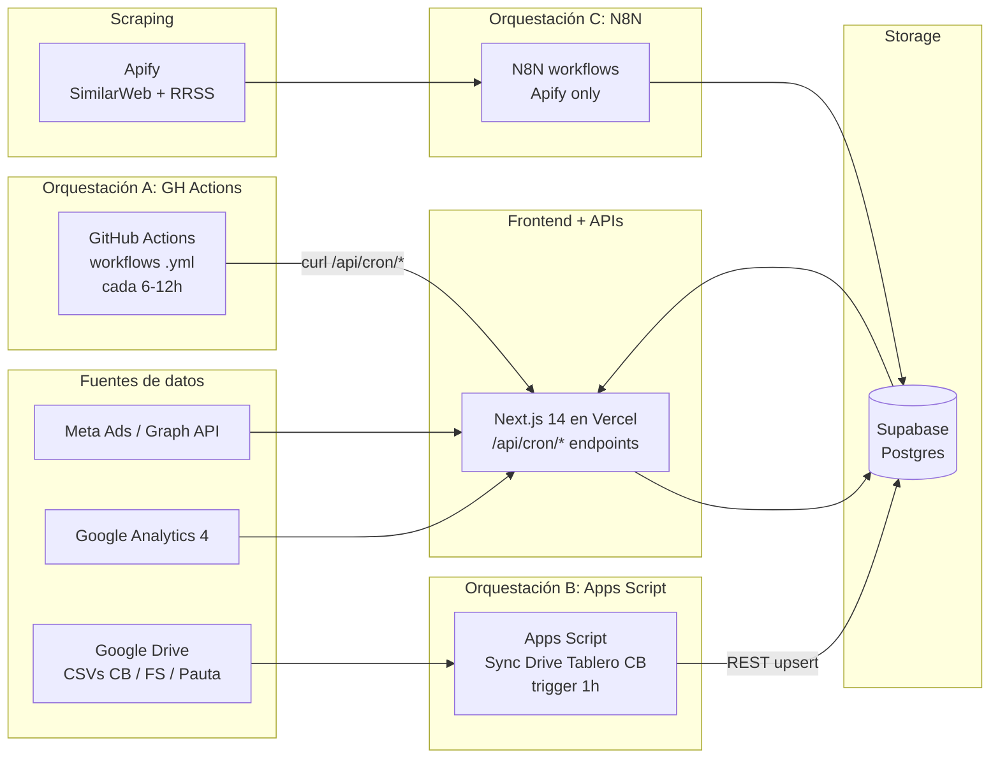

# Dashboard Mkt

Dashboard unificado de monitoreo de campañas digitales y offline. Consolida
Google Ads, Meta Ads, GA4 y canales offline, compara performance real vs
planning, visualiza el funnel completo (impresiones → clicks → sesiones →
conversiones) e incorpora inteligencia competitiva (web + redes sociales).

> Estado: app desplegada en Vercel con datos reales. Tres orquestadores:
>
> - **GitHub Actions** dispara los endpoints `/api/cron/*` del Next app para
>   GA4, Meta (orgánico FB/IG), paid creatives, sentiment, organic insights.
>   Ver [`docs/crons-github-actions.md`](docs/crons-github-actions.md).
> - **Apps Script "Sync Drive Tablero CB"** lee folders de Drive (CSVs de
>   Cuadros Básicos, Floor Share y Planning de Pauta) y los upsertea a
>   Supabase. Sin OAuth tokens — corre con la cuenta Google del dueño del
>   script. Ver [`docs/planning-media-sync.md`](docs/planning-media-sync.md).
> - **N8N** queda solo para Apify (scraping de competidores web/social).

---

## Arquitectura



Los crons de APIs (Meta FB/IG/paid, GA4, sentiment, organic-insights) viven
en `.github/workflows/` y disparan endpoints `/api/cron/*` — detalle en
[`docs/crons-github-actions.md`](docs/crons-github-actions.md).

Los syncs de archivos de Drive (Cuadros Básicos, Floor Share, Planning de
Pauta) viven en el Apps Script "Sync Drive Tablero CB" que se ejecuta cada
hora — detalle en [`docs/planning-media-sync.md`](docs/planning-media-sync.md).

**Stack**

- **Storage**: Supabase (Postgres 15)
- **Frontend**: Next.js 14 App Router + TypeScript + Tailwind + shadcn/ui
- **Visualización**: Recharts
- **Orquestación**: GitHub Actions (APIs) + Google Apps Script (Drive→Supabase) + N8N (Apify)
- **Scraping**: Apify actors (competencia web/social) vía N8N
- **Hosting**: Vercel (frontend) + Supabase (DB) + Apps Script (Google nativo) + N8N self-hosted/cloud

---

## Estructura del repo

```
dashboard-mkt/
├── apps/
│   └── web/                  # Next.js (frontend)
├── packages/
│   ├── db/                   # Cliente Supabase + tipos
│   └── shared/               # Tipos y utils compartidos
├── supabase/
│   ├── migrations/           # SQL versionado
│   └── seed/                 # Data de prueba
├── n8n-workflows/            # JSON exports versionados (fase 2)
└── docs/                     # Documentación adicional
```

---

## Setup local

### 1. Pre-requisitos

- **Node.js 20+** y **pnpm 9+** (`npm i -g pnpm`)
- Cuenta gratis en [supabase.com](https://supabase.com)
- Cuenta gratis en [github.com](https://github.com) (para hostear el repo)
- (Opcional fase 2) Cuenta en [vercel.com](https://vercel.com) para desplegar

### 2. Clonar e instalar

```bash
git clone https://github.com/<tu-usuario>/dashboard-mkt.git
cd dashboard-mkt
pnpm install
```

### 3. Crear el proyecto Supabase

Ver guía paso a paso en [`docs/supabase-setup.md`](docs/supabase-setup.md). Resumen:

1. Crear proyecto en supabase.com.
2. Ir a **SQL Editor** y ejecutar en orden:
   - `supabase/migrations/0001_initial_schema.sql`
   - `supabase/migrations/0002_views.sql`
   - `supabase/seed/seed.sql` (opcional, data de prueba)
3. Copiar URL + anon key desde **Settings → API**.

### 4. Variables de entorno

```bash
cp .env.example apps/web/.env.local
# editar apps/web/.env.local con tus valores reales
```

Variables requeridas en fase 1:

| Variable                          | Dónde se usa            |
|-----------------------------------|-------------------------|
| `NEXT_PUBLIC_SUPABASE_URL`        | Frontend + scripts      |
| `NEXT_PUBLIC_SUPABASE_ANON_KEY`   | Frontend (lectura RLS)  |
| `SUPABASE_SERVICE_ROLE_KEY`       | Scripts / N8N (server)  |
| `NEXT_PUBLIC_APP_URL`             | Frontend (links)        |

### 5. Levantar el frontend

```bash
pnpm dev
# → http://localhost:3000
```

---

## Convenciones críticas

### UTMs

El funnel **depende** de que las UTMs sean consistentes. Toda la convención
está en [`docs/utm-conventions.md`](docs/utm-conventions.md). Resumen:

- `utm_source`, `utm_medium`, `utm_campaign` → obligatorios
- Todo en **lowercase** y **kebab-case** (sin espacios, sin tildes)
- `utm_source` = plataforma (`google`, `facebook`, `instagram`, `tiktok`, ...)
- `utm_medium` = tipo de medio (`cpc`, `paid-social`, `email`, `display`, ...)
- `utm_campaign` = nombre interno de la campaña (`q2-search`, `lanzamiento-mayo`, ...)

### Migraciones

Toda modificación al schema se versiona como un archivo SQL nuevo:
`supabase/migrations/000N_descripcion.sql`. Nunca editar una migración ya aplicada.

### Workflows N8N

Cuando crees un workflow, exportalo como JSON y guardalo en
`n8n-workflows/<nombre>.json`. Así queda versionado y se puede importar en otra
instancia de N8N. Ver [`n8n-workflows/README.md`](n8n-workflows/README.md).

---

## Documentación

- [`docs/architecture.md`](docs/architecture.md) — detalle técnico de cada capa
- [`docs/utm-conventions.md`](docs/utm-conventions.md) — convención de UTMs (crítico)
- [`docs/supabase-setup.md`](docs/supabase-setup.md) — paso a paso para crear y aplicar el schema
- [`docs/planning-sheet-template.md`](docs/planning-sheet-template.md) — estructura del Sheet de planning
- [`docs/n8n-planning-setup.md`](docs/n8n-planning-setup.md) — setup del workflow planning N8N
- [`docs/n8n-ga4-setup.md`](docs/n8n-ga4-setup.md) — setup del workflow GA4 → web_traffic
- [`docs/n8n-ga4-demographics-setup.md`](docs/n8n-ga4-demographics-setup.md) — setup del workflow GA4 → tablas demográficas (device, geo, interest)
- [`docs/n8n-social-setup.md`](docs/n8n-social-setup.md) — setup del workflow Social Sheet → social_competitor + social_metrics
- [`docs/n8n-scraper-drean-setup.md`](docs/n8n-scraper-drean-setup.md) — setup del scraper adaptado de Tombaio para RRSS de Drean
- [`docs/n8n-competitor-web-setup.md`](docs/n8n-competitor-web-setup.md) — setup del scraper de tráfico web de competidores (Apify SimilarWeb)
- [`docs/planning-media-sync.md`](docs/planning-media-sync.md) — sync de Planning de Pauta (Drive CSV → planning_media) vía Apps Script
- [`docs/generador-contenido.md`](docs/generador-contenido.md) — **Generador de contenido orgánico** (`/contenido`): flujo actual (Ideogram + OpenAI, estética fija), trade-off, qué NO funciona y próximo paso
- [`docs/next-phases.md`](docs/next-phases.md) — roadmap fases 2/3/4

---

## Generador de contenido orgánico (`/contenido`)

Genera **piezas orgánicas para redes** (imagen + copy) por pilar, con la
**estética premium fija de Drean**. **Fuente de verdad completa (qué funciona,
qué NO, y el próximo paso):** [`docs/generador-contenido.md`](docs/generador-contenido.md).

**Conexiones:**

- **fal.ai → `fal-ai/ideogram/v3`** — ÚNICO modelo de imagen (respeta la estética premium). `FAL_KEY` (fal.ai/dashboard/keys, prepago).
- **OpenAI `gpt-4o-mini`** — brief: prompt de imagen (EN), caption (ES), hashtags, **mensaje clave = título + bajada** para la placa. `OPENAI_API_KEY`.
- **Supabase `meta_posts`** — top posts por pilar como insumo del brief.
- **Google Drive (agencia)** — packshots por modelo (carpeta **"Alta"**), en el catálogo `producto-catalog.ts` con `descripcion` + `medidas`.

**Flujo (todo con Ideogram):**

1. UI → `/api/generar-contenido` (pilar/categoría/modelo/formato/aspecto/cantidad).
2. Top posts del pilar → OpenAI arma el brief (escena + copy + mensaje clave).
3. **Ideogram v3** genera la imagen con la estética fija (`BRAND_LOOK`), proporción por categoría (heladera alta, cocina/lavarropas altura mesada). Con modelo, **recrea** ese electrodoméstico (descripción visual, **no packshot pixel-exacto**). En pilar *Experiencia uso*, con **personas** usando el producto.
4. El **mensaje clave** (título + bajada) se compone como **placa editable sobre la imagen** en el front (la IA no dibuja texto) + descarga PNG. 1–4 piezas.

> **Trade-off clave** (ver doc): no se puede producto pixel-exacto + estética
> premium + buena integración a la vez. Se eligió **estética** (Ideogram) →
> producto recreado, no exacto.
>
> **Qué NO funciona — no re-iterar:** Bria product-shot / 2-etapas (escenas
> claras o producto mal integrado), `product-photography` (passthrough),
> referencias de estilo por posteos (se sacó por decisión), `portrait_4_5`
> (inválido), packshots del `1000x1000` (son fichas; los limpios están en
> "Alta"), y la carpeta "MABE BRAND CENTER" no la indexa el Drive tool.
>
> **Próximo paso:** una herramienta de compositing/inpainting mejor que Bria
> para meter el **packshot real bien colocado** en la escena de Ideogram
> (inpainting con máscara / relight). Video (Kling/Veo) pendiente.

---

## Scripts

| Comando                | Acción                                                |
|------------------------|-------------------------------------------------------|
| `pnpm dev`             | Levanta el frontend en `localhost:3000`               |
| `pnpm build`           | Build de producción de todos los packages             |
| `pnpm lint`            | Lint en todo el monorepo                              |
| `pnpm typecheck`       | Type-check estricto en todo el monorepo               |
| `pnpm db:types`        | Regenera tipos TS desde Supabase (requiere CLI)       |

---

## Estado actual

**Lo que YA funciona:**

- [x] Schema de Supabase + migraciones versionadas
- [x] Monorepo con pnpm workspaces y cliente Supabase tipado
- [x] Frontend Next.js 14 leyendo datos reales (RSC + Supabase) con charts (Recharts)
- [x] Despliegue en Vercel (`dashboard-mkt-seven.vercel.app`)
- [x] Sync **GA4** (tráfico, landings, compras) vía GitHub Actions
- [x] Sync **Meta orgánico** (Page Drean FB + @dreanargentina IG) + sentiment IG
- [x] Endpoint de **paid creatives** Meta (`/api/cron/meta-paid-sync`) — operativo, a la espera de acceso a la Ad Account (ver Operación)
- [x] Convenciones UTM documentadas
- [x] **Generador de contenido orgánico** (`/contenido`) — imágenes vía fal.ai (**Ideogram v3**, estética premium fija) + copy con OpenAI. Con modelo, recrea el electrodoméstico (no packshot exacto). Placa título+bajada editable. Ver [`docs/generador-contenido.md`](docs/generador-contenido.md). Requiere `FAL_KEY` en Vercel.

**Lo que falta (fase 2+):**

- [ ] Integración Apify (scraping de competidores web) vía N8N
- [ ] Auth con Supabase (magic link)

Ver [`docs/next-phases.md`](docs/next-phases.md) para el roadmap detallado.

---

## Operación / Troubleshooting

Los syncs corren como GitHub Actions (detalle en
[`docs/crons-github-actions.md`](docs/crons-github-actions.md)). Para ver si
uno falló: repo → **Actions** → workflow → run rojo → logs con el JSON del
endpoint. Dos gotchas que ya nos mordieron:

### Competencia Web — historial mensual acumula de TODOS los snapshots

El scraper de SimilarWeb (Apify, vía N8N) corre semanal y guarda un snapshot
nuevo en `competitor_web` por cada corrida. Cada snapshot trae en el campo
`raw` los últimos ~3 meses de visitas estimadas por SimilarWeb.

**Decisión clave**: `getCompetitorMonthlyHistory()` mergea los meses de
**todos los snapshots** (no solo el último). Razón: si una corrida nueva
solo trae Mar/Abr/May, el código viejo "perdía" los meses anteriores que
estaban en snapshots viejos (Feb, Ene...). El merge preserva esos meses,
y cuando dos snapshots tienen el mismo mes, gana el más reciente (estimación
más fresca de SimilarWeb).

Como `fetchAll()` ordena por `fecha DESC`, el orden de iteración garantiza
que el snapshot más reciente entre primero al `Map<fecha, visitas>` y los
viejos solo agreguen meses que no estaban.

### Competencia Web — Drean usa SimilarWeb (no GA4) en la sección de benchmark

La página `/web` tiene una sección "Competencia Web" que compara Drean contra
competidores (Whirlpool, Philco, Electrolux, Gafa, Newsan).

**Decisión**: Drean usa **SimilarWeb** (igual que los competidores), NO GA4.
Razón: la comparación tiene que ser apples-to-apples — SimilarWeb estima
visitas con un panel + modelos, GA4 mide sesiones reales first-party. Mezclar
fuentes hace que Drean parezca artificialmente más grande (o más chico) que
los competidores.

GA4 sigue usándose en el **resto** de la página `/web` (KPIs de Drean,
canales, landings, demografía) que son métricas propias, no de benchmark.

Si alguna vez se quiere volver al modelo viejo (Drean=GA4 en la tabla y chart
de competencia), revertir el commit que removió `getDreanWebMetrics()` de la
sección.

### GA4 — el refresh token se muere cada ~7 días

Síntoma: el sync GA4 falla con `invalid_grant: Token has been expired or revoked`.
Causa: la app OAuth (Google Cloud → **Google Auth Platform → Público**) está en
estado **"Prueba/Testing"**, y en ese modo Google **caduca los refresh tokens a
los 7 días**. Fix permanente: **Publicar app** (pasar a "En producción"); ahí el
token deja de expirar. Si hay que regenerarlo, usar
[OAuth Playground](https://developers.google.com/oauthplayground) **con el client
propio** ("Use your own OAuth credentials", el cliente *Dashboard Vercel*) y scope
`https://www.googleapis.com/auth/analytics.readonly`; pegar el refresh token nuevo
en la env var **`GOOGLE_REFRESH_TOKEN`** de Vercel y **redeploy**.

### Meta paid — acceso por API a la cuenta de Drean

La pauta de Drean en Meta corre dentro de la cuenta publicitaria **Mabe Argentina**
(`act_1428795852368328`), propiedad del BM de OMD (`796317087092108`). El cron
`meta-paid-sync` lee esa cuenta con el **token del system user**
(`META_SYSTEM_USER_TOKEN`) que vive en nuestro BM (`122350585916257`).

**Pendiente operativo:** para que el cron corra solo todos los días, OMD tiene
que **compartir la cuenta Mabe con nuestro BM como partner** (acceso "Ver
rendimiento" o superior). Mientras eso no esté, el `schedule` queda
deshabilitado y el endpoint devuelve `No encontré cuenta… Disponibles: (ninguna)`.

**Backfill puntual sin esperar a OMD:** si alguien con acceso personal a la
cuenta genera un token de usuario en el [Graph API Explorer](https://developers.facebook.com/tools/explorer/)
(scopes: `ads_read`, `read_insights`, `business_management`; al autorizar, tildar
**OMD Argentina** en la pantalla de negocios), se puede correr el sync una vez
seteando estas envs en Vercel:

| Env var | Valor |
|---|---|
| `META_PAID_TOKEN_OVERRIDE` | el token `EAA...` de usuario (temporal, ~1-2 h) |
| `META_AD_ACCOUNT_ID` | `act_1428795852368328` (fija la cuenta sin depender del nombre) |

Y disparar el workflow desde **Actions → Meta paid creatives sync → Run workflow**
con el input `mes` (`YYYY-MM`). El workflow también acepta `debug=true` (lista
cuentas y permisos que ve el token, sin sincronizar) y `act_id` (override por
corrida). Después de cada backfill **borrar `META_PAID_TOKEN_OVERRIDE`** por
higiene.

**Imágenes permanentes (mirror al bucket):** las URLs de imágenes de Meta están
firmadas y caducan en 1-2 días. El endpoint espeja cada thumbnail al bucket
`meta-thumbs` de Supabase (migración `0039`) — la URL pública del bucket no
caduca. Para piezas de **video**, Meta solo expone un `thumbnail_url` de 64×64
desde el ad; la versión en alta vive en el post original y se trae vía
`effective_object_story_id → full_picture`, **leído con el token del system user**
(no con el override de usuario: el usuario típicamente no administra la Página).

### Apps Script "Sync Drive Tablero CB" — sync de archivos de Drive

Tres folders de Drive se sincronizan a Supabase con un único Apps Script que
corre cada hora.

| Folder Drive            | Property            | Tabla Supabase             | Proyecto Supabase         | Filename pattern                                                  |
|-------------------------|---------------------|----------------------------|---------------------------|-------------------------------------------------------------------|
| Cuadros Básicos         | `CB_FOLDER_ID`      | `cuadro_basico_semanal` + `contactos` | **CB** (`fsvdcpqzchrezkxflyfi`) | `NN.csv` (semana) o `tienda-promotor-supervisor*.csv` |
| Floor Share             | `FS_FOLDER_ID`      | `floor_share`              | **CB** (`fsvdcpqzchrezkxflyfi`) | `YYYY-MM_Categoria.csv` o `NN_Categoria.csv`                      |
| Planning de Pauta       | `PLANNING_FOLDER_ID`| `planning_media`           | **Principal** (`vtcrhyyirqexczycuwhe`) | `Mes-Pauta.xlsx` (planilla viva de OMD con 12 meses adentro)      |

**⚠️ Arquitectura multi-proyecto**: el dashboard usa **2 proyectos de Supabase**:

- **Principal** (`vtcrhyyirqexczycuwhe`) — donde viven `planning_media`,
  `meta_posts`, `ga4_*`, `pauta_performance`, `insights_log`, etc. Las
  dashboards de Next leen de acá.
- **CB** (`fsvdcpqzchrezkxflyfi`) — donde viven `cuadro_basico_semanal`,
  `floor_share`, `contactos`, **`sync_status`**.

El Apps Script escribe CB y Floor Share al proyecto CB (configurado en
`SUPABASE_URL`), pero **planning_media vive en el principal**. Por eso el
script usa un par de properties separado (`PLANNING_SUPABASE_URL` y
`PLANNING_SUPABASE_SECRET_KEY`) y una rama condicional en `syncPlanning` que
arma un `planningCtx` distinto al `ctx` general antes de upsertear.

**Por qué Apps Script y no GitHub Actions / Vercel:**

- Corre con la cuenta Google del dueño del script → cero OAuth refresh tokens
  para mantener / rotar / publicar.
- Triggers nativos de Google (`syncAll` cada 1h) sin secrets.
- Tabla `sync_status` (proyecto CB) trackea cada archivo por `drive_modified`
  → solo se reprocesa lo que cambió (idempotente y barato). Detalle clave: la
  comparación es contra `file.getLastUpdated()` en Drive, así que basta con
  editar el archivo para forzar re-sync. Si querés re-procesar a la fuerza
  sin tocar el archivo, borrar la fila de `sync_status` correspondiente.
- Upsert con `Prefer: resolution=merge-duplicates` por unique key compuesta
  → la data histórica nunca se pisa con ceros aunque borres archivos del folder.

**Script Properties requeridas (7 en total):**

| Property                          | Para qué                                                        |
|-----------------------------------|-----------------------------------------------------------------|
| `SUPABASE_URL`                    | URL del proyecto **CB** (CB / FS / contactos / sync_status)     |
| `SUPABASE_SECRET_KEY`             | service_role del proyecto CB                                    |
| `CB_FOLDER_ID`                    | ID del folder con CSVs de Cuadros Básicos                       |
| `FS_FOLDER_ID`                    | ID del folder con CSVs de Floor Share                           |
| `PLANNING_FOLDER_ID`              | ID del folder con `Mes-Pauta.xlsx` (Pauta-omd)                  |
| `PLANNING_SUPABASE_URL`           | URL del proyecto **Principal** (`vtcrhyyirqexczycuwhe`)         |
| `PLANNING_SUPABASE_SECRET_KEY`    | service_role del proyecto principal                             |

#### Formato del archivo `Mes-Pauta.xlsx` (planning de pauta)

OMD mantiene una planilla viva tipo `Junio-Pauta.xlsx` que contiene **todo el
año** (12 columnas mensuales) **con todas las categorías interleavadas**. Cada
mes te manda una versión nueva renombrada al mes vigente
(`Julio-Pauta.xlsx`, `Agosto-Pauta.xlsx`, etc.). El script parsea las 12
columnas mensuales de cada archivo, así jul-dic se mantienen actualizados con
el forecast más reciente y los meses pasados se refrescan si OMD ajustó algo.

**Estructura del Excel:**

| Campaña | Rol Of Comms | Sistema | Formato & Channel | Enero | Febrero | ... | Diciembre |
|---|---|---|---|---|---|---|---|
| (vacío) | Build | Total OFF | (vacío) | $-, $-, ... | (← fila skipeada por subtotal) |
| Brand | Build | TVC | Tanda | $- | $- | ... | $- |
| Brand | Build | OOH | Cartel Unicenter | $- | $- | ... | $9.800.000 |
| Heladera | Build | YouTube | Bumper | ... | (Heladera se mappea a "Refrigeración") |
| (vacío) | Build | Total ON | (vacío) | (← otra fila skipeada) |
| (vacío) | (vacío) | (vacío) | PERCEPCIÓN IIBB | $295.835 | ... | (cost row, campania='General', tipo='costo') |

**Reglas del parser `syncPlanning`:**

1. **Filename**: `Mes-Pauta.{csv,xlsx}` (mes en español, sin acentos). Para
   `.xlsx`, el script convierte a Google Sheets en memoria via Advanced Drive
   Service y borra la copia temporal al terminar.
2. **Detección de headers**: busca dinámicamente la fila que contiene
   `Formato` + (`Sistema` o `Rol`) + (`Campaña` o categoría inferible del
   filename). Las filas vacías arriba del header (logo, "2026", "Q1/Q2/Q3/Q4")
   se ignoran.
3. **Mapping de categorías** (`normalizePlanningCategoria`): "heladera" →
   `Refrigeración`, "refriger*" → `Refrigeración`, "cocina*" → `Cocina`,
   "lavado" → `Lavado`, "brand" → `Brand`, "promo*" → `Promoción`,
   "ugc" → `UGC`.
4. **Detección de subtotales** (`esPlanningSkip`): salta filas donde
   **sistema** o **formato** arrancan con `Total` o `Subtotal` (ej. "Total
   OFF", "Total ON", "TOTAL", "Total Campaña"). **Sin este filtro la inversión
   se cuenta 2.2× (subtotales + detalle)**.
5. **Detección de costos** (`esPlanningCosto`): filas cuyo `formato` matchea
   `/iibb|percep|cheque|impuesto|tech\s*fee|comisi/i` se marcan como
   `tipo='costo'`. Si la fila no tiene categoría asignada (típico de costos
   generales del mes), se le asigna `campania='General'`. Sin este fallback los
   costos no aparecen en `Costos adicionales` del dashboard.
6. **Parsing de moneda** (`parseLocaleNumber`): strippea `$`, espacios, `%`;
   convierte formato AR (`65.253.780,00`) a número JS. Sin el strip del `$`,
   todos los valores quedan en `null` y no se emite nada.
7. **12 columnas mensuales**: el parser detecta `Enero`..`Diciembre` como
   headers y emite una fila de `planning_media` por cada (data row × mes con
   inversión > 0). La fecha resultante usa el año de `PLANNING_YEAR` (default:
   año actual) y el mes correspondiente.

**Convenciones y troubleshooting completo** en
[`docs/planning-media-sync.md`](docs/planning-media-sync.md).

#### Operación cotidiana

**Subir un mes nuevo** (cada vez que OMD te mande pauta nueva):
1. Renombrar el archivo a `Mes-Pauta.xlsx` (ej. `Julio-Pauta.xlsx`).
2. Arrastrarlo al folder de Drive `PLANNING_FOLDER_ID`.
3. Esperar hasta 1h (trigger horario) o forzar manual: Apps Script editor →
   `syncAll` → Run.
4. Verificar en `/planning` que el mes nuevo aparezca con los totales correctos.

**Forzar re-procesamiento de un archivo ya sincronizado** (debugging):
```sql
-- En el proyecto CB
delete from sync_status where filename = 'Junio-Pauta.xlsx';
```
Luego correr `syncAll`. El archivo se reprocesará desde cero.

**Verificación de integridad post-sync** (los totales del DB tienen que
matchear el Excel — sumar `Total OFF` + `Total ON` del mes):
```sql
-- En el proyecto principal
select fecha,
       sum(inversion) filter (where tipo='media') as media,
       sum(inversion) filter (where tipo='costo') as costos
from planning_media
group by fecha
order by fecha;
```

#### Pre-requisitos del entorno

Para que el sync funcione hay que tener:

1. **Advanced Drive Service v2** habilitado en el Apps Script
   (Services → Drive API → Add → Identifier `Drive`, Version `v2`). Sin esto,
   los `.xlsx` no se pueden convertir a Sheets para parseo.
2. **Permisos OAuth**: la primera vez que corra `syncAll`, Google pide
   autorización para Drive (read/write para conversión temporal) y
   UrlFetchApp (para hablar con Supabase). Aceptar todo.
3. **Tabla `sync_status`** existente en el proyecto CB con columnas
   `filename, drive_id, drive_modified, synced_at, rows_processed, status,
   error_msg`.
4. **Tabla `planning_media`** existente en el proyecto principal (creada por
   `supabase/migrations/0004_planning_media.sql`) con la unique key compuesta
   `(fecha, campania, rol, sistema, formato, tipo)`.

### TikTok / Programmatic / YouTube — sin automatización todavía

La grilla "Piezas pautadas" del dashboard tiene 4 secciones (Meta, TikTok,
Programmatic, YouTube) que comparten la **misma tabla `meta_paid_creatives`**,
discriminadas por la columna `plataforma`. Hoy solo Meta tiene cron de API;
las otras 3 entran por **carga manual** (`source = 'looker_export'`).

| Plataforma | API necesaria | Estado |
|---|---|---|
| **TikTok** | TikTok Marketing API — requiere **app de desarrollador aprobada** (App ID + Secret + OAuth con el anunciante). El acceso al Business Center *solo* **no alcanza**: no hay API keys estáticas, todo es OAuth contra una app registrada. Pendiente: pedir a DDB/OMD si ya tienen una app aprobada para Mabe (`advertiser_id 7601141532934225927`). | Manual (export desde Business Center → Custom reports). Loader manual o `INSERT` armado a mano contra `meta_paid_creatives` con `plataforma='tiktok'`, `source='looker_export'`. |
| **YouTube** | Google Ads API (YouTube vive ahí, no en GA4). Proyecto aparte: OAuth + Developer Token de Google Ads + autorización del MCC que opera la cuenta. | Manual. Limitación conocida: el export de Looker **no trae inversión por anuncio** en YouTube. |
| **Programmatic** | DSP que pautó (DV360 / The Trade Desk / etc.). Cada DSP tiene su API. Decidir cuál primero según volumen. | Manual. |

### Thumbnails de las piezas — cómo funciona y límites (cerrado 2026-06-19)

El grid de "Piezas pautadas" (`/performance` → Por Medio) renderiza
`image_url ?? thumbnail_url` de `meta_paid_creatives`. **No hay nada que tocar en
el front**: todo es **origen de la imagen** en cada plataforma.

#### Meta (IG + FB) — resolución de imagen en alta

Para piezas de **video**, el ad solo expone un `thumbnail_url` de **64×64**; la
imagen en alta vive en el video/post. `/api/cron/meta-paid-sync` resuelve en
cascada (todo con el **token del system user** `META_SYSTEM_USER_TOKEN`, que
administra la Página Drean — el override de usuario NO sirve para esto):

1. **`video_id`** del creative, buscado en orden: inline (`video_id`,
   `object_story_spec.video_data.video_id`), `asset_feed_spec.videos` (creatives
   **dinámicos / Advantage+** — la mayoría de Drean), attachments del post
   (`effective_object_story_id`), y por último un **fetch directo del creative**
   (`/{creative_id}?fields=...`, que devuelve el `object_story_spec`/`asset_feed_spec`
   completo cuando la llamada masiva los trae incompletos).
2. Con el `video_id` → **`/{video_id}/thumbnails`** → se elige el de **mayor `width`**
   (el cover full-size, típicamente 1080).
3. Si no hay video: **`full_picture`** del post.
4. Fallback final: `image_url` / cover / thumbnail 64×64 (se ve pixelado).

**Mirror al bucket `meta-thumbs` (key `paid/{ad_id}-hdN.jpg`):** el helper
`mirrorMetaImage` **saltea la descarga si la key ya existe**, así que **cuando se
mejora la fuente hay que bumpear el sufijo** (`-hd6` → `-hd7` …) para forzar el
re-espejado. Key actual: **`-hd7`**. Después de deployar un cambio de resolución,
**re-correr `meta-paid-sync`** para que re-espeje.

**Diagnóstico (en la respuesta del cron):**
- `img_stats`: `{video_thumb, full_picture, fallback, max_thumb_w}` — cuántas
  piezas resolvieron por cada vía y el ancho máx. de thumbnail (1080 = OK).
- `fallback_sample`: lista las piezas que caen en fallback con qué tienen
  (`has_image_url`, `has_thumbnail`, `has_story`, `afs_videos`, `afs_images`, `src`).

**Modo repair (`?repair=1`, o input `repair` del workflow):** re-procesa por
**`creative_id` directo** las piezas Meta con imagen vieja (ads **eliminados** que
`/ads` ya no devuelve). En batches, en loop hasta `restantes=0`.

**Page size `limit=8`** en la llamada a `/ads`: la request (insights + creative +
`asset_feed_spec`) es pesada y pega contra el límite de datos de Meta. Páginas
chicas = respuestas completas y confiables.

> ⚠️ **Rate-limiting de Meta — NO correr el sync muchas veces seguidas.** Tras
> ~20 runs en una hora, Meta empieza a **degradar las respuestas**: devuelve
> `asset_feed_spec` sin `video_id` o tira `500 "reduce the amount of data"`, y
> **todo cae a fallback**. Si pasa: **no bumpees la key** (sobrescribirías las
> buenas con thumbnails chicos), dejá la key como está y **esperá ~1h**; el mirror
> reusa las imágenes en alta que **siguen en el bucket** bajo la key vigente.

**Limpieza hecha:** había **65 filas duplicadas** `source='looker_export'` con
`ad_id`/`creative_id` tipo `looker_xxx` (no existen en la API) que se veían
pixeladas (copias viejas de piezas que la API ya trae nítidas). Se borraron:
```sql
delete from meta_paid_creatives
where plataforma = 'meta' and source = 'looker_export' and ad_id like 'looker%';
```

**Límite real conocido:** quedan **~9 piezas CPC de video por mes** que **no
exponen el `video_id` por ninguna API** (probado: inline, post, `asset_feed_spec`,
fetch directo del creative). Su única fuente nítida es el **archivo original de la
agencia**. No es un bug — es el techo de la Graph API para esos creatives.

#### DV360 (Programmatic · YouTube · Marketplace) + TikTok — "Sin imagen"

Estas plataformas **no se cargan por la API de Meta** (TikTok es carga manual;
DV360 viene de sus reportes). Sus piezas no tienen `image_url`. Y **el reporte de
DV360 NO puede traer la imagen**: sus dimensiones de creative son solo metadata
(`Creative`, `Creative ID`, `Creative Source/Type/Size/Status/Width`) — **ninguna
es una URL de imagen**. O sea, cargar la imagen vía el reporte de DV360 por email
**está descartado por diseño**.

**Solución elegida: planilla de la agencia.** El grid ya muestra `image_url`, así
que solo falta la **fuente** de esos links. Se le pidió a la agencia una **planilla
de Google** (`Creativo · Plataforma · Link`) con el link por pieza:
- **YouTube / Demand Gen** → link del video de YouTube (thumbnail vía API/`i.ytimg.com`).
- **TikTok** → link del video de TikTok (thumbnail vía oEmbed).
- **Programmatic / Marketplace** → link público al archivo del creativo.

Pendiente: cuando llegue la planilla, sincronizarla a Supabase + cron que baje las
miniaturas al bucket `meta-thumbs` y complete `image_url`. La `YOUTUBE_API_KEY` ya
está cargada como secret para la parte de YouTube. (Las mismas ~9 CPC de Meta sin
`video_id` también se resolverían por esta vía si la agencia las incluye.)
