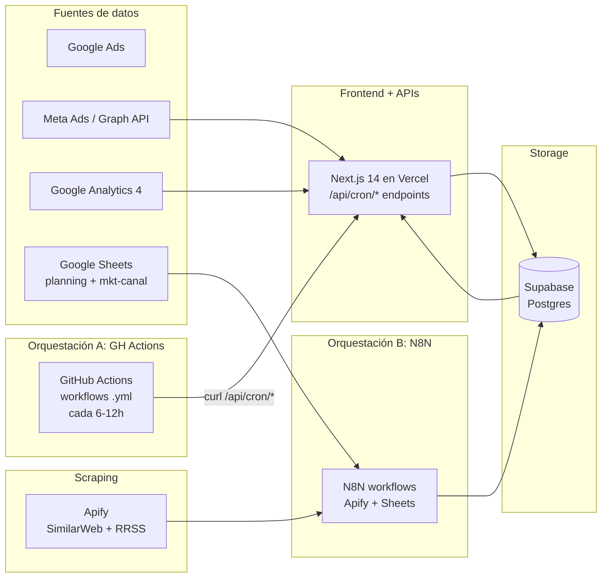

# Dashboard Mkt

Dashboard unificado de monitoreo de campañas digitales y offline. Consolida
Google Ads, Meta Ads, GA4 y canales offline, compara performance real vs
planning, visualiza el funnel completo (impresiones → clicks → sesiones →
conversiones) e incorpora inteligencia competitiva (web + redes sociales).

> Estado: app desplegada en Vercel con datos reales. Los syncs de **GA4,
> Meta (orgánico FB/IG) y paid creatives corren con GitHub Actions** que
> disparan los endpoints `/api/cron/*` del propio Next app — **no usan N8N**.
> N8N queda reservado solo para Apify (scraping de competidores) y Google
> Sheets (planning). Ver [`docs/crons-github-actions.md`](docs/crons-github-actions.md).

---

## Arquitectura



Los crons periódicos (Meta FB / IG / paid, GA4, sentiment) viven en
`.github/workflows/` y disparan los endpoints `/api/cron/*` del Next app.
El detalle de cada workflow está en
[`docs/crons-github-actions.md`](docs/crons-github-actions.md).

**Stack**

- **Storage**: Supabase (Postgres 15)
- **Frontend**: Next.js 14 App Router + TypeScript + Tailwind + shadcn/ui
- **Visualización**: Recharts
- **Orquestación**: N8N (ingesta scheduled)
- **Scraping**: Apify actors (competencia web, fase 2)
- **Hosting**: Vercel (frontend) + Supabase (DB) + N8N self-hosted/cloud

---

## Estructura del repo

```
dashboard-mkt/
├── apps/
│   └── web/                  # Next.js (frontend)
├── packages/
│   ├── db/                   # Cliente Supabase + tipos
│   └── shared/               # Tipos y utils compartidos
├── supabase/
│   ├── migrations/           # SQL versionado
│   └── seed/                 # Data de prueba
├── n8n-workflows/            # JSON exports versionados (fase 2)
└── docs/                     # Documentación adicional
```

---

## Setup local

### 1. Pre-requisitos

- **Node.js 20+** y **pnpm 9+** (`npm i -g pnpm`)
- Cuenta gratis en [supabase.com](https://supabase.com)
- Cuenta gratis en [github.com](https://github.com) (para hostear el repo)
- (Opcional fase 2) Cuenta en [vercel.com](https://vercel.com) para desplegar

### 2. Clonar e instalar

```bash
git clone https://github.com/<tu-usuario>/dashboard-mkt.git
cd dashboard-mkt
pnpm install
```

### 3. Crear el proyecto Supabase

Ver guía paso a paso en [`docs/supabase-setup.md`](docs/supabase-setup.md). Resumen:

1. Crear proyecto en supabase.com.
2. Ir a **SQL Editor** y ejecutar en orden:
   - `supabase/migrations/0001_initial_schema.sql`
   - `supabase/migrations/0002_views.sql`
   - `supabase/seed/seed.sql` (opcional, data de prueba)
3. Copiar URL + anon key desde **Settings → API**.

### 4. Variables de entorno

```bash
cp .env.example apps/web/.env.local
# editar apps/web/.env.local con tus valores reales
```

Variables requeridas en fase 1:

| Variable                          | Dónde se usa            |
|-----------------------------------|-------------------------|
| `NEXT_PUBLIC_SUPABASE_URL`        | Frontend + scripts      |
| `NEXT_PUBLIC_SUPABASE_ANON_KEY`   | Frontend (lectura RLS)  |
| `SUPABASE_SERVICE_ROLE_KEY`       | Scripts / N8N (server)  |
| `NEXT_PUBLIC_APP_URL`             | Frontend (links)        |

### 5. Levantar el frontend

```bash
pnpm dev
# → http://localhost:3000
```

---

## Convenciones críticas

### UTMs

El funnel **depende** de que las UTMs sean consistentes. Toda la convención
está en [`docs/utm-conventions.md`](docs/utm-conventions.md). Resumen:

- `utm_source`, `utm_medium`, `utm_campaign` → obligatorios
- Todo en **lowercase** y **kebab-case** (sin espacios, sin tildes)
- `utm_source` = plataforma (`google`, `facebook`, `instagram`, `tiktok`, ...)
- `utm_medium` = tipo de medio (`cpc`, `paid-social`, `email`, `display`, ...)
- `utm_campaign` = nombre interno de la campaña (`q2-search`, `lanzamiento-mayo`, ...)

### Migraciones

Toda modificación al schema se versiona como un archivo SQL nuevo:
`supabase/migrations/000N_descripcion.sql`. Nunca editar una migración ya aplicada.

### Workflows N8N

Cuando crees un workflow, exportalo como JSON y guardalo en
`n8n-workflows/<nombre>.json`. Así queda versionado y se puede importar en otra
instancia de N8N. Ver [`n8n-workflows/README.md`](n8n-workflows/README.md).

---

## Documentación

- [`docs/architecture.md`](docs/architecture.md) — detalle técnico de cada capa
- [`docs/utm-conventions.md`](docs/utm-conventions.md) — convención de UTMs (crítico)
- [`docs/supabase-setup.md`](docs/supabase-setup.md) — paso a paso para crear y aplicar el schema
- [`docs/planning-sheet-template.md`](docs/planning-sheet-template.md) — estructura del Sheet de planning
- [`docs/n8n-planning-setup.md`](docs/n8n-planning-setup.md) — setup del workflow planning N8N
- [`docs/n8n-ga4-setup.md`](docs/n8n-ga4-setup.md) — setup del workflow GA4 → web_traffic
- [`docs/n8n-ga4-demographics-setup.md`](docs/n8n-ga4-demographics-setup.md) — setup del workflow GA4 → tablas demográficas (device, geo, interest)
- [`docs/n8n-social-setup.md`](docs/n8n-social-setup.md) — setup del workflow Social Sheet → social_competitor + social_metrics
- [`docs/n8n-scraper-drean-setup.md`](docs/n8n-scraper-drean-setup.md) — setup del scraper adaptado de Tombaio para RRSS de Drean
- [`docs/n8n-competitor-web-setup.md`](docs/n8n-competitor-web-setup.md) — setup del scraper de tráfico web de competidores (Apify SimilarWeb)
- [`docs/n8n-planning-media-setup.md`](docs/n8n-planning-media-setup.md) — setup del workflow Pauta-omd (Sheet wide → planning_media)
- [`docs/next-phases.md`](docs/next-phases.md) — roadmap fases 2/3/4

---

## Scripts

| Comando                | Acción                                                |
|------------------------|-------------------------------------------------------|
| `pnpm dev`             | Levanta el frontend en `localhost:3000`               |
| `pnpm build`           | Build de producción de todos los packages             |
| `pnpm lint`            | Lint en todo el monorepo                              |
| `pnpm typecheck`       | Type-check estricto en todo el monorepo               |
| `pnpm db:types`        | Regenera tipos TS desde Supabase (requiere CLI)       |

---

## Estado actual

**Lo que YA funciona:**

- [x] Schema de Supabase + migraciones versionadas
- [x] Monorepo con pnpm workspaces y cliente Supabase tipado
- [x] Frontend Next.js 14 leyendo datos reales (RSC + Supabase) con charts (Recharts)
- [x] Despliegue en Vercel (`dashboard-mkt-seven.vercel.app`)
- [x] Sync **GA4** (tráfico, landings, compras) vía GitHub Actions
- [x] Sync **Meta orgánico** (Page Drean FB + @dreanargentina IG) + sentiment IG
- [x] Endpoint de **paid creatives** Meta (`/api/cron/meta-paid-sync`) — operativo, a la espera de acceso a la Ad Account (ver Operación)
- [x] Convenciones UTM documentadas

**Lo que falta (fase 2+):**

- [ ] Integración Apify (scraping de competidores web) vía N8N
- [ ] Auth con Supabase (magic link)

Ver [`docs/next-phases.md`](docs/next-phases.md) para el roadmap detallado.

---

## Operación / Troubleshooting

Los syncs corren como GitHub Actions (detalle en
[`docs/crons-github-actions.md`](docs/crons-github-actions.md)). Para ver si
uno falló: repo → **Actions** → workflow → run rojo → logs con el JSON del
endpoint. Dos gotchas que ya nos mordieron:

### GA4 — el refresh token se muere cada ~7 días

Síntoma: el sync GA4 falla con `invalid_grant: Token has been expired or revoked`.
Causa: la app OAuth (Google Cloud → **Google Auth Platform → Público**) está en
estado **"Prueba/Testing"**, y en ese modo Google **caduca los refresh tokens a
los 7 días**. Fix permanente: **Publicar app** (pasar a "En producción"); ahí el
token deja de expirar. Si hay que regenerarlo, usar
[OAuth Playground](https://developers.google.com/oauthplayground) **con el client
propio** ("Use your own OAuth credentials", el cliente *Dashboard Vercel*) y scope
`https://www.googleapis.com/auth/analytics.readonly`; pegar el refresh token nuevo
en la env var **`GOOGLE_REFRESH_TOKEN`** de Vercel y **redeploy**.

### Meta paid — el system user no ve la cuenta

Síntoma: `/api/cron/meta-paid-sync` devuelve `No encontré cuenta con 'drean'...
Disponibles: (ninguna)`. Causa: el token (`META_SYSTEM_USER_TOKEN`) es de un
**usuario del sistema** que **no tiene asignada la Ad Account** de Drean (que vive
dentro de la cuenta **Mabe Argentina**, `act_1428795852368328`, del BM de OMD). El
acceso *personal* a Ads Manager **no** alcanza: hay que asignarle la cuenta al
usuario del sistema (compartirla con nuestro BM `122350585916257` o crear un system
user en el BM de OMD). Además, como la cuenta no se llama "Drean", el
autodescubrimiento por nombre falla → hay que forzar la cuenta con el input
**`act_id=act_1428795852368328`** del workflow (o `?act_id=` en el endpoint). El
workflow acepta inputs `debug` (lista cuentas/permisos que ve el token), `act_id`
y `mes` para diagnóstico. _(Pendiente: soportar una env var `META_AD_ACCOUNT_ID`
para fijar la cuenta sin pasar el input en cada corrida.)_
