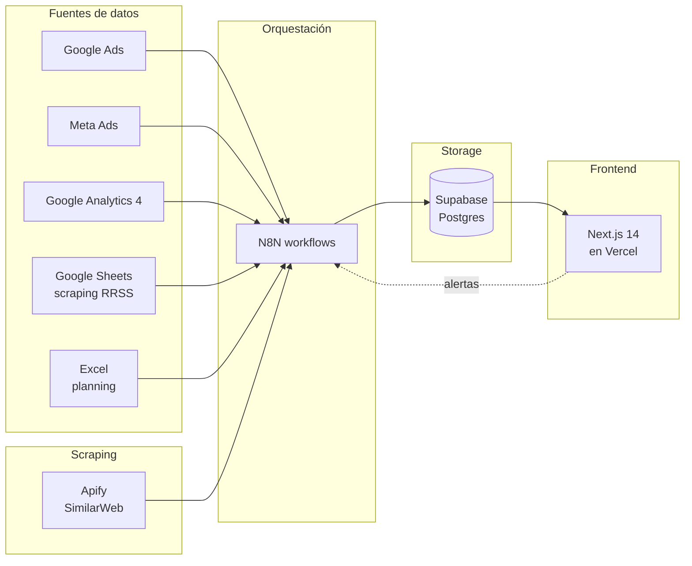

# Dashboard Mkt

Dashboard unificado de monitoreo de campañas digitales y offline. Consolida
Google Ads, Meta Ads, GA4 y canales offline, compara performance real vs
planning, visualiza el funnel completo (impresiones → clicks → sesiones →
conversiones) e incorpora inteligencia competitiva (web + redes sociales).

> Fase 1 (esta entrega): infraestructura, modelo de datos y frontend base.
> Las integraciones con N8N, Apify y Google Sheets vienen en fase 2.

---

## Arquitectura



**Stack**

- **Storage**: Supabase (Postgres 15)
- **Frontend**: Next.js 14 App Router + TypeScript + Tailwind + shadcn/ui
- **Visualización**: Recharts
- **Orquestación**: N8N (ingesta scheduled)
- **Scraping**: Apify actors (competencia web, fase 2)
- **Hosting**: Vercel (frontend) + Supabase (DB) + N8N self-hosted/cloud

---

## Estructura del repo

```
dashboard-mkt/
├── apps/
│   └── web/                  # Next.js (frontend)
├── packages/
│   ├── db/                   # Cliente Supabase + tipos
│   └── shared/               # Tipos y utils compartidos
├── supabase/
│   ├── migrations/           # SQL versionado
│   └── seed/                 # Data de prueba
├── n8n-workflows/            # JSON exports versionados (fase 2)
└── docs/                     # Documentación adicional
```

---

## Setup local

### 1. Pre-requisitos

- **Node.js 20+** y **pnpm 9+** (`npm i -g pnpm`)
- Cuenta gratis en [supabase.com](https://supabase.com)
- Cuenta gratis en [github.com](https://github.com) (para hostear el repo)
- (Opcional fase 2) Cuenta en [vercel.com](https://vercel.com) para desplegar

### 2. Clonar e instalar

```bash
git clone https://github.com/<tu-usuario>/dashboard-mkt.git
cd dashboard-mkt
pnpm install
```

### 3. Crear el proyecto Supabase

Ver guía paso a paso en [`docs/supabase-setup.md`](docs/supabase-setup.md). Resumen:

1. Crear proyecto en supabase.com.
2. Ir a **SQL Editor** y ejecutar en orden:
   - `supabase/migrations/0001_initial_schema.sql`
   - `supabase/migrations/0002_views.sql`
   - `supabase/seed/seed.sql` (opcional, data de prueba)
3. Copiar URL + anon key desde **Settings → API**.

### 4. Variables de entorno

```bash
cp .env.example apps/web/.env.local
# editar apps/web/.env.local con tus valores reales
```

Variables requeridas en fase 1:

| Variable                          | Dónde se usa            |
|-----------------------------------|-------------------------|
| `NEXT_PUBLIC_SUPABASE_URL`        | Frontend + scripts      |
| `NEXT_PUBLIC_SUPABASE_ANON_KEY`   | Frontend (lectura RLS)  |
| `SUPABASE_SERVICE_ROLE_KEY`       | Scripts / N8N (server)  |
| `NEXT_PUBLIC_APP_URL`             | Frontend (links)        |

### 5. Levantar el frontend

```bash
pnpm dev
# → http://localhost:3000
```

---

## Convenciones críticas

### UTMs

El funnel **depende** de que las UTMs sean consistentes. Toda la convención
está en [`docs/utm-conventions.md`](docs/utm-conventions.md). Resumen:

- `utm_source`, `utm_medium`, `utm_campaign` → obligatorios
- Todo en **lowercase** y **kebab-case** (sin espacios, sin tildes)
- `utm_source` = plataforma (`google`, `facebook`, `instagram`, `tiktok`, ...)
- `utm_medium` = tipo de medio (`cpc`, `paid-social`, `email`, `display`, ...)
- `utm_campaign` = nombre interno de la campaña (`q2-search`, `lanzamiento-mayo`, ...)

### Migraciones

Toda modificación al schema se versiona como un archivo SQL nuevo:
`supabase/migrations/000N_descripcion.sql`. Nunca editar una migración ya aplicada.

### Workflows N8N

Cuando crees un workflow, exportalo como JSON y guardalo en
`n8n-workflows/<nombre>.json`. Así queda versionado y se puede importar en otra
instancia de N8N. Ver [`n8n-workflows/README.md`](n8n-workflows/README.md).

---

## Documentación

- [`docs/architecture.md`](docs/architecture.md) — detalle técnico de cada capa
- [`docs/utm-conventions.md`](docs/utm-conventions.md) — convención de UTMs (crítico)
- [`docs/supabase-setup.md`](docs/supabase-setup.md) — paso a paso para crear y aplicar el schema
- [`docs/next-phases.md`](docs/next-phases.md) — roadmap fases 2/3/4

---

## Scripts

| Comando                | Acción                                                |
|------------------------|-------------------------------------------------------|
| `pnpm dev`             | Levanta el frontend en `localhost:3000`               |
| `pnpm build`           | Build de producción de todos los packages             |
| `pnpm lint`            | Lint en todo el monorepo                              |
| `pnpm typecheck`       | Type-check estricto en todo el monorepo               |
| `pnpm db:types`        | Regenera tipos TS desde Supabase (requiere CLI)       |

---

## Estado actual

**Lo que YA funciona:**

- [x] Schema de Supabase (8 tablas + 2 vistas)
- [x] Seed de datos de prueba
- [x] Monorepo con pnpm workspaces
- [x] Cliente Supabase tipado (browser + server + service role)
- [x] Frontend Next.js 14 con sidebar y 6 páginas placeholder
- [x] Convenciones UTM documentadas

**Lo que falta (fase 2+):**

- [ ] Workflows N8N de ingesta (Google Ads, Meta, GA4, Sheets)
- [ ] Integración Apify (scraping de competidores web)
- [ ] Lectura real de datos en el frontend (RSC + Supabase)
- [ ] Charts con Recharts
- [ ] Auth con Supabase (magic link)
- [ ] Despliegue en Vercel

Ver [`docs/next-phases.md`](docs/next-phases.md) para el roadmap detallado.
