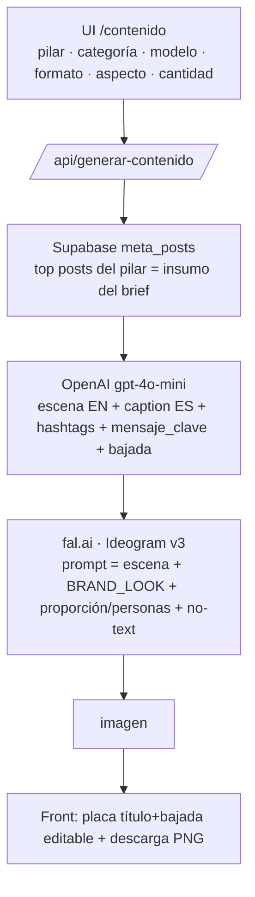

# Generador de Contenido Orgánico (`/contenido`)

Genera **piezas orgánicas para redes** (imagen + copy) por pilar de contenido,
con la **estética premium fija de Drean**. Estado: operativo para **imágenes**.
Video (Kling/Veo) queda para una próxima etapa.

> **Esta doc es la fuente de verdad para continuar.** Incluye lo que funciona,
> lo que **NO** funciona (para no re-iterar) y el próximo paso. Leer completo
> antes de tocar el generador.

---

## 1. Cómo funciona hoy (arquitectura actual)

- **Un solo modelo de imagen: fal.ai → `fal-ai/ideogram/v3`.** Es el único que
  respeta la estética premium (oscura/cálida/cinematográfica).
- **Estética FIJA** (`BRAND_LOOK` en `contenido-shared.ts`): cálida, oscura,
  low-key, cinematográfica, maderas de nogal + mármol/piedra, negro mate, acero;
  luz dramática cálida; **minimalista, un solo producto, sin cargar**. Evita
  explícitamente lo claro/aireado/lavado/pastel/stock. **Es el único lugar para
  calibrar el look.**
- **Modelo de producto (opcional):** si se elige un modelo del catálogo, se
  **describe** ese electrodoméstico en el prompt (nombre + `descripcion` con
  config de puertas/terminación) para que Ideogram lo **recree lo más parecido
  posible**. ⚠️ **NO es el packshot pixel-exacto** — es una recreación fiel en
  forma/tipo, no la foto real (ver §3).
- **Proporción por categoría** (`PROPORCION`): heladera = alta; cocina/lavarropas
  = altura mesada (al ras); + medidas reales del catálogo. Sólo se aplica en modo
  producto-hero (sin personas).
- **Personas:** obligatorias cuando el pilar es **Experiencia uso**. En ese caso
  el **foco son las personas usando el producto** (no el hero minimalista) y no
  se aplica `MINIMAL`/proporción (competían con la gente).
- **Copy/brief:** OpenAI `gpt-4o-mini` genera `escena` (EN, para la imagen),
  `caption_es`, `hashtags`, y **mensaje_clave (título) + bajada** para la placa.
- **Placa / grafismo:** la IA **NO dibuja texto** (`NO_TEXT`, evita "DREAM
  KITCHEN" y logos falsos). El título + bajada se componen **sobre la imagen en
  el front** (editables) y la **descarga PNG** graba el texto con canvas.
- **Cantidad:** 1–4 piezas en paralelo, cada una con su propio brief.

### Variables de entorno (Vercel)
- `FAL_KEY` — fal.ai (prepago). `OPENAI_API_KEY` — ya estaba.

### Archivos
| Archivo | Rol |
|---|---|
| `app/contenido/page.tsx` | UI + placa editable + descarga PNG + panel "¿Cómo se generan las imágenes?" |
| `app/api/generar-contenido/route.ts` | Endpoint: brief (OpenAI) + imagen (Ideogram). `BRAND_LOOK`, `MINIMAL`, `PROPORCION`, `PERSONAS_ON`, `NO_TEXT` |
| `lib/contenido-shared.ts` | `BRAND_LOOK` (estética fija), `CATEGORIAS` |
| `lib/producto-catalog.ts` | Catálogo: `sku, nombre, tipo, driveFileId, medidas, descripcion` |
| `lib/fal-client.ts` | Cliente fal.ai + `FAL_SIZES` |

### Catálogo de producto (actual)
- **Cocinas:** CD7609EI, CD5617AI0. **Heladeras:** DTP469LKRSS0 (French Door).
  **Lavarropas:** LSCDR1208SG0 (lavaseca).
- Packshots limpios: en la carpeta **"Alta"** de cada modelo en el Drive de la
  agencia (los `1000x1000` son **fichas/lifestyle**, NO packshots). Nota: hoy el
  packshot sólo se usa como miniatura de referencia visual; la imagen la genera
  Ideogram (ver §3).
- Cada modelo lleva `descripcion` (rasgos visuales EN) y `medidas` para el prompt.

---

## 2. El trade-off de fondo (importante)

Con las herramientas disponibles **no se puede** tener las tres cosas a la vez:
**(a) producto pixel-exacto + (b) estética premium correcta + (c) buena
integración/proporción**. Hay que elegir:

| Opción | Producto | Estética | Integración |
|---|---|---|---|
| **Ideogram (ACTUAL)** | recreado (parecido, no exacto) | ✅ premium | ✅ buena |
| Bria product-shot | ✅ exacto | ❌ clara/genérica | media |
| 2-etapas (Ideogram→Bria) | ✅ exacto | ✅ | ❌ mal (escala/ángulo, "salido del mueble") |

**Decisión tomada:** priorizar **estética** → Ideogram. Para orgánico/awareness,
una pieza hermosa y on-brand pesa más que el producto pixel-exacto.

---

## 3. Qué NO funciona (no re-iterar) — el cementerio

- **`fal-ai/bria/product-shot` (producto real):** genera fondos **claros /
  e-commerce**, ignora la estética oscura/cálida por más que se la pida en
  `scene_description`. Descartado.
- **Bria 2-etapas (Ideogram arma escena → Bria pega el packshot con
  `ref_image_url`):** aplica el estilo pero el producto queda **mal integrado**:
  escala equivocada (producto más alto que la mesada), ángulo/perspectiva que no
  matchea, "salido del mueble". Descartado.
- **`fal-ai/image-apps-v2/product-photography`:** sólo mejora la luz, devuelve el
  packshot casi igual (no arma escena). Descartado.
- **Referencias de estilo (posteos vía Ideogram `image_urls`):** se probó dejar
  que el usuario elija posteos para definir el estilo. Se sacó por decisión: se
  prefirió **un estilo único bien definido** (`BRAND_LOOK`) en vez de elegir
  referencias. Además Bria **no acepta** referencias.
- **Selector de 4 estilos** (Cocina cálida premium / Experiencia uso / Porfolio
  Superior / Funciones especiales): se reemplazó por el `BRAND_LOOK` único.
- **`image_size: "portrait_4_5"`** en fal → 422. Válidos: `square_hd | square |
  portrait_4_3 | portrait_16_9 | landscape_4_3 | landscape_16_9`.
- **Packshots desde `1000x1000`:** son fichas técnicas (con logo/callouts) y
  lifestyle, NO packshots limpios. Los limpios están en **"Alta"**.
- **Drive tool no indexa** la carpeta **"MABE | BRAND CENTER"** (search_files
  devuelve vacío para SKUs que están ahí, ej. CD6007MI/CD6009EI). Para esos hay
  que pasar el link directo.
- **Imágenes muy oscuras:** si se exagera el "dark/low-key", quedan
  underexpuestas → `BRAND_LOOK` incluye "producto bien iluminado, no
  underexpuesto".
- **Bria placement `original`:** producto gigante (piso a techo) porque el
  packshot llena su frame.

---

## 4. Próximo paso (cuando retomemos)

**Objetivo:** meter el **producto real (packshot)** dentro de la escena de
Ideogram —que quedó muy buena— **bien colocado**, para tener estética premium +
producto exacto + buena integración.

Ideas a probar (herramienta de compositing/inpainting mejor que Bria):
- **Inpainting con máscara:** generar la escena con Ideogram con un **hueco/máscara**
  donde va el producto → inpaint del packshot real en esa región
  (ej. FLUX inpaint / fal). Requiere generar/definir la máscara.
- **Relight/harmonization:** componer el packshot en la escena y **re-iluminarlo**
  para que matchee la luz cálida (modelos de relighting).
- **Modelos de "product in scene"** más nuevos de fal que respeten iluminación y
  perspectiva (evaluar los que salgan; Bria quedó descartado por el look claro).
- Evaluar controlar **escala y perspectiva** con placement manual + máscara.

Hasta lograrlo, el modo producto **recrea** el electrodoméstico (no exacto).

### Otros pendientes
- **Video corto** (Kling 3.0 / Veo 3.1) vía la cola async de fal.
- **Ampliar catálogo** con más flagships (packshot limpio de "Alta"; para
  CD6007MI/CD6009EI y más heladeras/lavarropas hace falta el link porque el tool
  no ve "MABE BRAND CENTER").
- Confirmar/ajustar `medidas` reales de cada modelo con las fichas técnicas.
