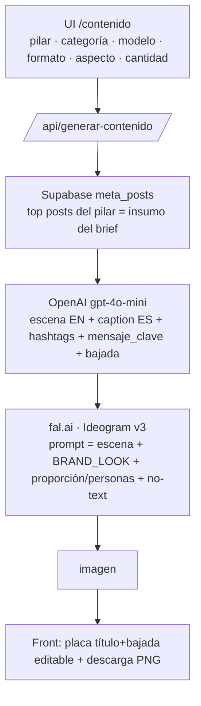

# Generador de Contenido Orgánico (`/contenido`)

Genera **piezas orgánicas para redes** (imagen + copy) por pilar de contenido,
con la **estética premium fija de Drean**. Estado: operativo para **imágenes**.
Video (Kling/Veo) queda para una próxima etapa.

> **Esta doc es la fuente de verdad para continuar.** Incluye lo que funciona,
> lo que **NO** funciona (para no re-iterar) y el próximo paso. Leer completo
> antes de tocar el generador.

---

## 1. Cómo funciona hoy (arquitectura actual)

- **Un solo modelo de imagen: fal.ai → `fal-ai/ideogram/v3`.** Es el único que
  respeta la estética premium (oscura/cálida/cinematográfica).
- **Estética FIJA** (`BRAND_LOOK` en `contenido-shared.ts`): cálida, oscura,
  low-key, cinematográfica, maderas de nogal + mármol/piedra, negro mate, acero;
  luz dramática cálida; **minimalista, un solo producto, sin cargar**. Evita
  explícitamente lo claro/aireado/lavado/pastel/stock. **Es el único lugar para
  calibrar el look.**
- **Modelo de producto → motor automático (sin toggle):**
  - **Con un modelo elegido → Foto real (Nano Banana):** se le pasa el **packshot
    real** (`driveImageUrl(driveFileId)`) a **Nano Banana** (`fal-ai/nano-banana/edit`,
    Gemini 2.5 Flash Image edit) y arma la escena premium **alrededor del producto
    sin alterarlo**. Preserva el producto exacto + respeta el `BRAND_LOOK`. Es el
    modo por defecto con producto (Nano Banana quedó mejor que Ideogram — decisión
    del usuario). Aspecto: lo define la foto real (~1:1), no el preset.
  - **Sin modelo → Ideogram:** genera la escena desde texto. En categoría
    **"Todo el porfolio"** usa `PORFOLIO_SCENE` (muestra el **lineup** Drean —
    heladera + cocina + lavarropas juntos, pieza de marca — en vez de un solo
    producto) y el brief de OpenAI recibe `esPorfolio` para describir el lineup.
- **Brillo/acabado (`ACABADO` por categoría):** heladeras = chapa de acero MUY
  brillante y reflejante; lavarropas = cuerpo grafito bien iluminado (no negro) con
  cromados/vidrio con brillo. + `PRODUCT LIGHTING` fuerte en el prompt de edición
  (el producto es lo más iluminado). Sin esto Nano Banana subexponía el producto.
- **Tipografía de placa: Manrope** (self-hosted en `public/fonts/Manrope-Variable.ttf`,
  `@font-face` en `globals.css`). Se aplica a la placa (vista previa + descarga
  canvas). El canvas espera `document.fonts.load(...Manrope)` antes de grabar.
- **Proporción por categoría** (`PROPORCION`): heladera = alta; cocina/lavarropas
  = altura mesada (al ras); + medidas reales del catálogo. Sólo se aplica en modo
  producto-hero (sin personas).
- **Personas:** obligatorias cuando el pilar es **Experiencia uso**. En ese caso
  el **foco son las personas usando el producto** (no el hero minimalista) y no
  se aplica `MINIMAL`/proporción (competían con la gente).
- **Copy/brief:** OpenAI `gpt-4o-mini` genera `escena` (EN, para la imagen),
  `caption_es`, `hashtags`, y **mensaje_clave (título) + bajada** para la placa.
- **Placa / grafismo:** la IA **NO dibuja texto** (`NO_TEXT`, evita "DREAM
  KITCHEN" y logos falsos). El título + bajada se componen **sobre la imagen en
  el front** (editables) y la **descarga PNG** graba el texto con canvas.
- **Cantidad:** 1–4 piezas en paralelo, cada una con su propio brief.
- **Detalles (texto libre):** campo opcional; se inyecta en los 3 prompts como
  `USER DETAILS (follow exactly): …` (ej. "puertas cerradas", "vista frontal",
  "sin comida adentro"). Sirve para forzar detalles puntuales que el modelo varía.
- **Descarga con / sin texto:** dos botones — "Con texto" graba la placa en el PNG
  (canvas), "Sin texto" baja la foto limpia (para editar el copy aparte).

### Variables de entorno (Vercel)
- `FAL_KEY` — fal.ai (prepago). `OPENAI_API_KEY` — ya estaba.

### Archivos
| Archivo | Rol |
|---|---|
| `app/contenido/page.tsx` | UI + placa editable + descarga PNG + panel "¿Cómo se generan las imágenes?" |
| `app/api/generar-contenido/route.ts` | Endpoint: brief (OpenAI) + imagen (Ideogram). `BRAND_LOOK`, `MINIMAL`, `PROPORCION`, `PERSONAS_ON`, `NO_TEXT` |
| `lib/contenido-shared.ts` | `BRAND_LOOK` (estética fija), `CATEGORIAS` |
| `lib/producto-catalog.ts` | Catálogo: `sku, nombre, tipo, driveFileId, medidas, descripcion` |
| `lib/fal-client.ts` | Cliente fal.ai + `FAL_SIZES` |

### Catálogo de producto (actual)
- **Cocinas:** CD7609EI, CD5617AI0. **Heladeras:** DTP469LKRSS0 (French Door).
  **Lavarropas:** LSCDR1208SG0 (lavaseca).
- Packshots limpios: en la carpeta **"Alta"** de cada modelo en el Drive de la
  agencia (los `1000x1000` son **fichas/lifestyle**, NO packshots). Nota: hoy el
  packshot sólo se usa como miniatura de referencia visual; la imagen la genera
  Ideogram (ver §3).
- Cada modelo lleva `descripcion` (rasgos visuales EN) y `medidas` para el prompt.

---

## 2. El trade-off de fondo (importante)

Con las herramientas disponibles **no se puede** tener las tres cosas a la vez:
**(a) producto pixel-exacto + (b) estética premium correcta + (c) buena
integración/proporción**. Hay que elegir:

| Opción | Producto | Estética | Integración |
|---|---|---|---|
| **Ideogram (ACTUAL)** | recreado (parecido, no exacto) | ✅ premium | ✅ buena |
| Bria product-shot | ✅ exacto | ❌ clara/genérica | media |
| 2-etapas (Ideogram→Bria) | ✅ exacto | ✅ | ❌ mal (escala/ángulo, "salido del mueble") |

**Decisión tomada:** priorizar **estética** → Ideogram. Para orgánico/awareness,
una pieza hermosa y on-brand pesa más que el producto pixel-exacto.

---

## 3. Qué NO funciona (no re-iterar) — el cementerio

- **`fal-ai/bria/product-shot` (producto real):** genera fondos **claros /
  e-commerce**, ignora la estética oscura/cálida por más que se la pida en
  `scene_description`. Descartado.
- **Bria 2-etapas (Ideogram arma escena → Bria pega el packshot con
  `ref_image_url`):** aplica el estilo pero el producto queda **mal integrado**:
  escala equivocada (producto más alto que la mesada), ángulo/perspectiva que no
  matchea, "salido del mueble". Descartado.
- **`fal-ai/image-apps-v2/product-photography`:** sólo mejora la luz, devuelve el
  packshot casi igual (no arma escena). Descartado.
- **Referencias de estilo (posteos vía Ideogram `image_urls`):** se probó dejar
  que el usuario elija posteos para definir el estilo. Se sacó por decisión: se
  prefirió **un estilo único bien definido** (`BRAND_LOOK`) en vez de elegir
  referencias. Además Bria **no acepta** referencias.
- **Selector de 4 estilos** (Cocina cálida premium / Experiencia uso / Porfolio
  Superior / Funciones especiales): se reemplazó por el `BRAND_LOOK` único.
- **`image_size: "portrait_4_5"`** en fal → 422. Válidos: `square_hd | square |
  portrait_4_3 | portrait_16_9 | landscape_4_3 | landscape_16_9`.
- **Packshots desde `1000x1000`:** son fichas técnicas (con logo/callouts) y
  lifestyle, NO packshots limpios. Los limpios están en **"Alta"**.
- **Drive tool no indexa** la carpeta **"MABE | BRAND CENTER"** (search_files
  devuelve vacío para SKUs que están ahí, ej. CD6007MI/CD6009EI). Para esos hay
  que pasar el link directo.
- **Imágenes muy oscuras:** si se exagera el "dark/low-key", quedan
  underexpuestas → `BRAND_LOOK` incluye "producto bien iluminado, no
  underexpuesto".
- **Bria placement `original`:** producto gigante (piso a techo) porque el
  packshot llena su frame.

---

## 4. Producto real — estado actual (Nano Banana)

**Implementado:** modo **"Foto real"** con **Nano Banana** (`fal-ai/nano-banana/edit`,
Gemini 2.5 Flash Image edit). Toma el packshot real como referencia y arma la
escena premium alrededor sin alterar el producto — el enfoque de "product in
scene" que en §3 quedaba pendiente. Es el modelo de edición por referencia que
**no existía** cuando se probó Bria; por eso ahora sí es viable "producto real +
estética premium".

**⚠️ Pendiente: validar calidad en la app deployada.** No se pudo validar desde
el entorno de dev (sin `FAL_KEY` local + egress limitado). Hay que generar con el
toggle "Foto real" y evaluar: preservación del producto, integración/relight,
respeto del `BRAND_LOOK`.

**Si Nano Banana no convence, alternativas (1 línea, cambiar `MODEL_EDIT`):**
- `fal-ai/gemini-25-flash-image/edit` (mismo modelo, id alternativo).
- **Flux Kontext** (`fal-ai/flux-pro/kontext`) — usa `image_url` (singular) en vez
  de `image_urls`; más control fotográfico.
- **Seedream v4 edit** (`fal-ai/bytedance/seedream/v4/edit`).

**Limitación conocida:** en modo Foto real el **aspecto** lo define la foto de
referencia (packshot ~1:1), no el preset — el control de vertical/story es un
"hint" en el prompt, no garantizado.

## 6. Calendario editorial — Fase 1 (entrada principal)

> **Ruteo:** `/contenido` redirige al **calendario** (`/contenido/calendario`), que
> es la entrada principal de "Generador de Contenido". El generador de piezas
> sueltas quedó en **`/contenido/generar`** (accesible desde el calendario).

Cockpit para planificar el mes: grilla mensual + panel del día. Cada pieza se
guarda en Supabase (`contenido_calendario`, migración 0075) con sus parámetros,
el contenido generado (editable) y un estado (pendiente → generado → aprobado →
publicado).

- **Generación reutilizable:** la lógica del generador se extrajo a
  `lib/contenido-generar.ts` (`generarPiezas`), que usan tanto `/api/generar-contenido`
  como `/api/contenido/calendario/generar`.
- **Endpoints:** `/api/contenido/calendario` (GET lista por rango, POST upsert,
  DELETE), `/api/contenido/calendario/generar` (POST {id} → genera y guarda).
  Escriben con service-role (`lib/supabase-admin.ts`).
- **Flujo:** agregás piezas a un día → "Generar" (imagen + copy) → editás
  título/bajada/caption → **Aprobar** ✓.
- **Fase 2 (pendiente):** publicación automática en IG/FB. Necesita permisos de
  publicación de Meta (`instagram_content_publish`, `pages_manage_posts`), espejar
  la imagen a un bucket permanente (las URLs de fal caducan) y un cron scheduler.

## 7. Modo Creativo / editorial (efemérides, trending, beneficio, disruptivo)

Además del modo **Producto** (estética premium fija), hay un modo **Creativo**
para posts conceptuales que salen de la cocina y del producto-hero: efemérides,
trending topics, beneficios (sin producto), ideas disruptivas.

- **Inputs:** `tipoContenido` = creativo · `subtipo` (efemeride/trending/beneficio/
  disruptivo) · `idea` (texto libre: el tema/concepto).
- **Brief:** OpenAI como **director creativo** (`disenarBriefCreativo`) arma el
  concepto según la idea + sub-tipo (producto ausente/sutil/metafórico).
- **Estética:** `BRAND_CREATIVE` — flexible (exterior/urbano/aspiracional/surreal)
  pero **con freno de marca**: premium, cohesiva, argentina, cálida (no "stock").
  Ideogram, sin `MINIMAL`/`PROPORCION`/producto-hero.
- **Integrado** al generador y al calendario (columnas `tipo_contenido`, `subtipo`,
  `idea` — migración 0077).

## 5. Video (image-to-video)

**Implementado.** Botón **"Generar video"** en cada pieza → anima la imagen ya
generada (image-to-video). Clips cortos (Kling **5s**). Corre en la **cola async**
de fal (`queue.fal.run`, `falVideoQueue` en `fal-client.ts`: submit → poll →
resultado). Route `/api/generar-video`.

- **Selector Kling / Veo** para comparar:
  - Kling: `fal-ai/kling-video/v2.1/master/image-to-video` (5s).
  - Veo: `fal-ai/veo3/image-to-video` (**mínimo ~8s** — puede pasarse de 6s).
- **Movimiento:** `MOTION_BASE` (push-in cinematográfico sutil, premium) + texto
  libre opcional del usuario (ej. "la puerta se abre").
- **Pendiente de validar** en la app (no se pudo desde dev). Si un id de modelo
  cambia/404ea, se ajusta en `VIDEO_MODELS`. El video es LENTO (~1-3 min) y CARO.

### Otros pendientes
- **Ampliar catálogo** con más flagships (packshot limpio de "Alta"; para
  CD6007MI/CD6009EI y más heladeras/lavarropas hace falta el link porque el tool
  no ve "MABE BRAND CENTER").
- Confirmar/ajustar `medidas` reales de cada modelo con las fichas técnicas.
