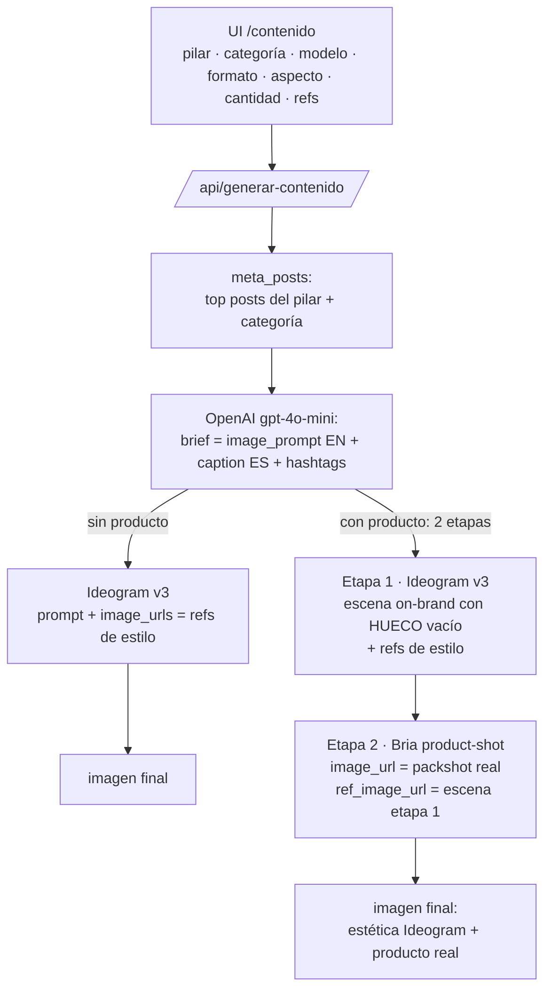

# Generador de Contenido Orgánico (`/contenido`)

Herramienta para generar **piezas orgánicas para redes** (imagen + copy) por
pilar de contenido, con la **estética premium fija de Drean**.

> Estado: operativo para **imágenes**. Video (Kling/Veo) queda para una próxima
> etapa.

## ⚠️ Actualización (estado actual — leer esto primero)

El flujo se simplificó mucho respecto de lo que describe el resto de este doc
(que quedó como historial de lo probado):

- **Todo se genera con fal.ai → Ideogram v3.** Es el único modelo de imagen.
  Ideogram respeta la estética premium; **Bria (`product-shot`) se descartó**
  porque generaba escenas claras/genéricas y no aplicaba el look de marca.
- **No se usa el packshot real pixel-exacto.** Si se elige un modelo del
  catálogo, se **describe ese electrodoméstico** en el prompt para que se parezca
  (en la estética), pero la imagen la genera Ideogram. (Se probó Bria con el
  packshot real: no respeta tonos/luz → descartado.)
- **Estética FIJA (sin selector de estilos ni referencias):** vive en
  `BRAND_LOOK` (en `contenido-shared.ts`) — cálida, oscura, low-key,
  cinematográfica, maderas de nogal + mármol, minimalista, un solo producto.
  Se sacaron: el selector de estilos (los 4 ESTILOS), y el selector de posteos
  de referencia (Ideogram `image_urls`) — el usuario pidió un estilo único bien
  definido, no elegir referencias.
- **Proporción por categoría** (`PROPORCION` en la route): heladera = alta;
  cocina/lavarropas = altura mesada (al ras). + medidas reales del catálogo.
- **Copy/brief:** OpenAI `gpt-4o-mini` (prompt de imagen, caption, hashtags,
  **mensaje clave = título + bajada**). La placa se compone sobre la imagen en el
  front (editable + descarga PNG). La IA NO dibuja texto (`NO_TEXT`).
- **Personas:** obligatorias cuando el pilar es *Experiencia uso*.
- **Catálogo de producto** (`producto-catalog.ts`): cocinas CD7609/CD5617,
  heladera DTP469, lavaseca LSCDR1208. Packshots limpios de la carpeta "Alta"
  del Drive (los `1000x1000` son fichas/lifestyle, no packshots).

Lo de abajo (Bria, pipeline 2 etapas, referencias, estilos, mirror) es
**historial** de lo que se probó y descartó — útil para no repetir.

---

## 1. Herramientas y conexiones

| Capa | Servicio | Uso | Auth / config |
|------|----------|-----|----------------|
| **Copy / brief creativo** | OpenAI `gpt-4o-mini` | Diseña el brief: prompt de imagen (inglés), caption ES, hashtags, guión de carrusel | `OPENAI_API_KEY` (ya existía en el proyecto) |
| **Generación de imagen (escena)** | fal.ai — `fal-ai/ideogram/v3` | Texto→imagen. Acepta `image_urls` como **referencias de estilo** (clona paleta/luz/estética de posts reales) | `FAL_KEY` (header `Authorization: Key <FAL_KEY>`) |
| **Producto real en escena** | fal.ai — `fal-ai/bria/product-shot` | Toma el packshot real (`image_url`) y lo compone en una escena nueva vía `scene_description` (texto) **o** `ref_image_url` (imagen de fondo) | `FAL_KEY` |
| **Top posts + referencias** | Supabase `meta_posts` | Ranking por pilar (score = interacciones + views·0.05, reach ≥ 500). `thumbnail_url` = imagen real del post (espejada al bucket público `meta-thumbs`) | Supabase server client |
| **Packshots de producto** | Google Drive (agencia Mabe) | Biblioteca oficial de assets por categoría/modelo. Archivos "cualquiera con el link" → URL pública `lh3.googleusercontent.com/d/<id>` | Catálogo estático en código |

### Variables de entorno necesarias (Vercel)

- `FAL_KEY` — crear en **fal.ai/dashboard/keys**. fal es **prepago** (cargar
  saldo). Sin esta var, la UI muestra un aviso claro y no rompe.
- `OPENAI_API_KEY` — ya estaba configurada.

---

## 2. Flujo de generación

Hay **dos modos**, según se elija o no un modelo de producto:



- **Modo genérico (sin modelo):** Ideogram v3 genera la escena completa
  (electrodoméstico incluido, generado por IA) usando las referencias de estilo
  elegidas. Mejor integración estética; el electrodoméstico **no es un SKU real**.
- **Modo producto real (con modelo), pipeline de 2 etapas:**
  1. Ideogram genera la **escena on-brand vacía** (con las refs de estilo, un
     hueco donde va el producto, sin electrodoméstico, sin texto).
  2. Bria compone el **packshot real** usando esa escena como fondo
     (`ref_image_url`). Combina estética linda + producto fiel.

Se generan **N piezas en paralelo** (1–4), cada una con su propio brief para dar
variedad. La respuesta es `{ piezas: [{ imagen, caption, hashtags, slides, image_prompt }] }`.

---

## 3. Archivos

| Archivo | Rol |
|---------|-----|
| `apps/web/src/app/contenido/page.tsx` | UI: filtros (pilar/categoría/modelo/formato/aspecto/cantidad), selector de referencias de estilo (miniaturas + pegar URL), render de N piezas |
| `apps/web/src/app/api/generar-contenido/route.ts` | Endpoint principal. Brief (OpenAI) + generación (Ideogram / pipeline Bria 2 etapas). `maxDuration=300` |
| `apps/web/src/app/api/contenido/referencias/route.ts` | Devuelve candidatos de referencia de estilo (thumbnails de top posts) para el selector |
| `apps/web/src/lib/contenido-queries.ts` | `getTopByPilar`, `getReferenciaCandidatos` (server-only, Supabase) |
| `apps/web/src/lib/contenido-shared.ts` | Constantes sin server-only: `CATEGORIAS`, `PLACEMENT_GUIDE` (lineamientos de colocación), helpers |
| `apps/web/src/lib/producto-catalog.ts` | Catálogo estático de modelos → packshot (Drive fileId → URL pública). `getModelos`, `getModelo`, `driveImageUrl` |
| `apps/web/src/lib/fal-client.ts` | Cliente REST mínimo de fal.ai (`falImage`) + `FAL_SIZES` |

---

## 4. Catálogo de producto (Drive)

Los packshots viven en el Drive de la agencia (Mabe), carpeta raíz
`1TvlTec-43cMoUMvNtLRf4XQ5Zdui3bAD`, con estructura:

```
Categoría (HELADERAS, COCINAS, LAVARROPAS, ...)
  └─ Tipo (NO FROST, CARGA FRONTAL, ...)
      └─ Modelo/SKU (DSP610IORSS0, CD7609EI, ...)
          ├─ 1000x1000/  ← packshots JPG
          └─ Presentacion ...pdf
```

**Los archivos están compartidos como "cualquiera con el link puede ver"**, así
que fal.ai los lee directo con `https://lh3.googleusercontent.com/d/<fileId>` —
**no hace falta espejar a Supabase**.

### Cómo agregar un modelo al catálogo

1. Navegar en Drive a la carpeta del SKU → `1000x1000`.
2. **Elegir un packshot con front limpio** sobre fondo blanco (NO interiores,
   NO puertas abiertas, NO detalle). Ojo: muchos folders tienen sólo interiores.
3. Copiar el `fileId` de esa imagen.
4. Agregar la entrada en `producto-catalog.ts` → `PRODUCTO_CATALOG[categoria]`:
   `{ sku, nombre, tipo, driveFileId }`.

Semilla actual: **cocinas → CD7609EI** (front limpio, `CD7609EI-2.jpg`).
Heladeras/lavarropas vacíos a la espera de curar SKUs con front limpio.

---

## 5. Aprendizajes (qué probamos — evitar re-iterar)

| Probado | Resultado | Decisión |
|---------|-----------|----------|
| `image_size: "portrait_4_5"` en fal | 422: valor inválido | Usar el enum válido: `square_hd \| square \| portrait_4_3 \| portrait_16_9 \| landscape_4_3 \| landscape_16_9` |
| `fal-ai/image-apps-v2/product-photography` para producto | Devolvía el packshot casi igual (sólo mejora luz, no arma escena) | Descartado. Usar `fal-ai/bria/product-shot` |
| Packshot heladera DSP610IORSS0 | Su folder `1000x1000` NO tiene front exterior limpio (todo interiores/puertas abiertas) | Sacado del catálogo. Verificar front limpio antes de sembrar cualquier SKU |
| Ideogram v3 sin regla anti-texto | Inventaba texto/logos falsos ("DREAM KITCHEN", logo mal escrito) | Regla dura `noText` en el prompt (la placa/logo se agregan en diseño) |
| Bria con `scene_description` (texto) y `placement_type: original` | Producto fiel pero "salido del mueble" / mal integrado. El modo sin producto integra mejor | Pipeline de 2 etapas: Ideogram arma la escena → Bria usa `ref_image_url`. La estética la controla el usuario con refs |
| Drive vía `drive.google.com/uc` / mirror a Supabase | Innecesario: archivos son públicos | URL directa `lh3.googleusercontent.com/d/<id>` |

### Limitaciones conocidas

- **Colocación del producto (Bria):** compone el packshot como recorte de tamaño
  fijo y genera el fondo alrededor, así que la alineación con muebles/mesadas no
  es exacta. Se mitiga con `PLACEMENT_GUIDE` + pipeline 2 etapas, pero es un techo
  del modelo. El modo sin producto integra mejor a costa de un electrodoméstico
  genérico.
- **Entorno de desarrollo:** la política de egress de la sesión de dev bloquea
  `fal.ai`, `drive.google.com` y `lh3.googleusercontent.com`. La validación de
  parámetros de fal se hace en la primera generación en **Vercel** (no desde dev).

---

## 6. Pendiente / próximos pasos

- [ ] **Video corto** (Kling 3.0 / Veo 3.1) vía la cola async de fal (`queue.fal.run` + polling).
- [ ] **Ampliar catálogo** de modelos por categoría (lavarropas/heladeras) con fronts limpios curados desde el Drive.
- [ ] Mejorar la **integración del producto** en la escena (probar otros modelos de inpainting/compositing si hace falta).
- [ ] Guardar/versionar las piezas generadas (historial) si se decide.
