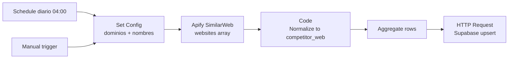

# Setup del workflow: Competitor Web Traffic (Apify SimilarWeb)

Workflow N8N que diariamente scrapea métricas de tráfico web de los
competidores (vía Apify SimilarWeb) y las guarda en la tabla `competitor_web`
de Supabase, alimentando la sección de tráfico web en `/competitors`.

## Arquitectura



## Pre-requisitos

- Cuenta Apify activa (el usuario ya tiene una).
- Credencial Apify OAuth2 conectada en N8N (la misma del scraper de RRSS sirve).
- Tabla `competitor_web` ya existente en Supabase (migration 0001 — ya aplicada).

## Paso 1 — Importar el workflow

1. Bajate `n8n-workflows/competitor-web-sync.json` del repo.
2. N8N → **Workflows → Create → ⋮ → Import from File**.
3. Renombrá a **"Competitor Web Traffic Sync"**.

## Paso 2 — Configurar dominios

Doble-click en el nodo **"Set Config"**. En el código vas a ver el array
`COMPETIDORES`:

```js
const COMPETIDORES = [
  { competidor: 'Drean',          dominio: 'drean.com.ar',            es_propio: true  },
  { competidor: 'Electrolux',     dominio: 'tienda.electrolux.com.ar', es_propio: false },
  { competidor: 'Gafa',           dominio: 'tienda.gafa.com.ar',       es_propio: false },
  { competidor: 'Philco',         dominio: 'philco.com.ar',            es_propio: false },
  { competidor: 'Philco (Newsan)',dominio: 'tiendanewsan.com.ar',      es_propio: false },
  { competidor: 'Whirlpool',      dominio: 'whirlpool.com.ar',         es_propio: false },
];
```

Editá según necesites (sumar/sacar competidores, cambiar el nombre legible).

## Paso 3 — Conectar credencial de Apify

Doble-click en el nodo **"Apify — SimilarWeb"** → seleccioná tu credencial
Apify OAuth2 ya configurada.

> 💡 El actor configurado por default es `tri_angle/similar-web-scraper`. Si
> tenés otro actor de SimilarWeb que preferís, cambialo en el dropdown del
> nodo. La estructura de respuesta puede variar — el nodo "Normalize" intenta
> múltiples claves comunes, pero si tu actor devuelve campos con otros nombres,
> editá la función `pick()` en el normalize.

## Paso 4 — Configurar Supabase

Mismas dos opciones que los otros workflows:

### A) Variables de entorno (Pro/Enterprise)

- `SUPABASE_URL` = `https://vtcrhyyirqexczycuwhe.supabase.co`
- `SUPABASE_SERVICE_ROLE_KEY` = `sb_secret_...`

### B) Hardcodear (Starter/Free)

En el nodo **"Supabase — Upsert competitor_web"**:

- **URL**: reemplazar por:
  ```
  https://TU-PROJECT.supabase.co/rest/v1/competitor_web?on_conflict=fecha,competidor,source
  ```
- **Headers**:
  - `apikey`: tu secret key de Supabase (`sb_secret_...`)
  - `Authorization`: `Bearer ` + tu secret key
  - `Content-Type`: `application/json`
  - `Prefer`: `resolution=merge-duplicates,return=representation`

## Paso 5 — Probar

1. Save.
2. Click en **Schedule Trigger** → **▶ Execute workflow**.
3. Apify tarda **3-8 minutos** por dominio (SimilarWeb scraping es lento).
   Con 5 dominios, esperá 15-30 min en total.
4. Verificar en Supabase → **Table Editor → `competitor_web`**. Deberías ver
   5 filas con `visitas_estimadas`, `bounce_rate`, etc.

## Paso 6 — Activar schedule

Toggle a **Active**. Va a correr cada día a las 4 AM. Si los costos de Apify
suben mucho (datos de SimilarWeb no cambian día a día), cambiá la frecuencia
a semanal editando el nodo Schedule.

## Costos estimados

- Apify SimilarWeb scrapers: **~$0.05–0.10 por dominio por run**.
- 5 dominios × 30 corridas/mes = **~$7.50–15/mes** en diario.
- Si lo bajamos a semanal: **~$1.50–3/mes**. Recomendado salvo que necesites
  detección de cambios diaria.

## Schema referencia

La tabla `competitor_web` (migration 0001) tiene:

| Columna | Tipo | Notas |
|---|---|---|
| `fecha` | date | Fecha de la corrida |
| `competidor` | text | Nombre legible (ej: "Drean") |
| `dominio` | text | Dominio (ej: "drean.com.ar") |
| `visitas_estimadas` | bigint | Visitas mensuales totales |
| `visitantes_unicos` | bigint | Visitantes únicos mensuales |
| `bounce_rate` | numeric(5,4) | 0.45 = 45% |
| `pages_per_visit` | numeric(8,2) | Páginas por visita |
| `avg_visit_duration` | numeric(10,2) | Segundos |
| `fuentes_trafico` | jsonb | Search / Social / Direct / Referral % |
| `paginas_top` | jsonb | Array de URLs top |
| `paises_top` | jsonb | Array de países top |
| `keywords_top` | jsonb | Array de keywords top |
| `source` | text | `apify_similarweb` |
| `raw` | jsonb | Respuesta cruda del actor (para debug) |

Unique constraint: `(fecha, competidor, source)` → un row por (día, marca, fuente).

## Troubleshooting

### El actor devuelve campos con nombres distintos
Editá el normalize Code node. Las llamadas `pick(r, ['key1', 'key2', ...])`
prueban múltiples nombres. Agregá las llaves que use tu actor específico.

### Empty rows o data inconsistente
SimilarWeb scrapers son **estimaciones**, no medidas reales. Marcas chicas
con poco tráfico pueden tener data nula o muy aproximada. Eso es esperado.

### Tarda demasiado
SimilarWeb tiene rate limits agresivos. Si 5 dominios toman >30min,
considerá bajar a 3 dominios prioritarios o frecuencia semanal.
