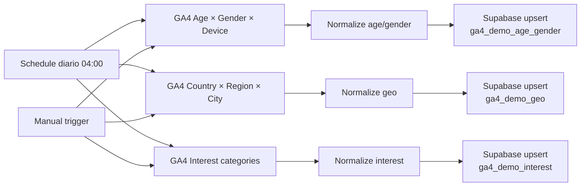

# Setup del workflow: GA4 Demographics Sync

Workflow N8N que cada día (4 AM) trae los últimos 30 días de **datos
demográficos** desde Google Analytics 4 y los escribe en tres tablas de
Supabase:

- `ga4_demo_age_gender` → edad × género × device
- `ga4_demo_geo` → país × región × ciudad × device
- `ga4_demo_interest` → categorías de interés in-market

## Por qué tres reports y tres tablas

GA4 aplica **data thresholding** cuando Google Signals está activo: oculta
filas con pocos usuarios para proteger anonimato. El thresholding se vuelve
agresivo cuando combinás muchas dimensiones demográficas en un solo report —
podés terminar con la mitad de las filas como `(other)`.

La fix correcta es hacer **tres reports chicos** en paralelo, cada uno con
2-4 dimensiones. Cada uno preserva mucho mejor su resolución y vive en su
propia tabla.

## Arquitectura

## Pre-requisitos

- Migration `0003_ga4_demographics.sql` aplicada en Supabase.
- **Google Signals** activado en la propiedad GA4 (Admin → Data Settings →
  Data Collection → Google signals data collection).
- **Granular location and device data** activado en la misma pantalla.
- Cuenta de Google con rol Viewer o superior en la propiedad GA4.
- Property ID de GA4 (9 dígitos).

## Paso 1 — Aplicar la migration

En el SQL Editor de Supabase, correr el contenido de
`supabase/migrations/0003_ga4_demographics.sql`. Crea las 3 tablas con sus
unique constraints (que usan `nulls not distinct` para que el upsert funcione
aunque algunas dimensiones vengan en NULL).

## Paso 2 — Importar el workflow

1. Bajate `ga4-demographics-sync.json` desde el repo.
2. En n8n.cloud: **Workflows → Create Workflow → ⋮ → Import from File**.
3. Renombralo a **GA4 Demographics Sync** y guardalo.

## Paso 3 — Configurar los 3 nodos GA4

Los **tres nodos** GA4 necesitan el mismo Property ID y la misma credencial.
La versión del nodo GA4 en n8n.cloud a veces ignora el Property ID del JSON
import: si después de importar ves el placeholder `REPLACE_WITH_YOUR_GA4_PROPERTY_ID`
o el dropdown del nodo está incompleto, configurá a mano siguiendo estas
tablas.

### Nodo "GA4 — Age × Gender × Device"

- **Property ID**: tu número de 9 dígitos.
- **Date Range**: Last 30 Days (Start `30daysAgo`, End `yesterday`).
- **Dimensions** (4): `date`, `userAgeBracket`, `userGender`, `deviceCategory`.
- **Metrics** (5): `sessions`, `totalUsers`, `newUsers`, `engagedSessions`, `conversions`.
- **Return All**: ON.
- **Simplify Output**: ON.

### Nodo "GA4 — Country × Region × City"

- **Property ID**: el mismo.
- **Date Range**: Last 30 Days.
- **Dimensions** (5): `date`, `country`, `region`, `city`, `deviceCategory`.
- **Metrics** (5): `sessions`, `totalUsers`, `newUsers`, `engagedSessions`, `conversions`.
- **Return All**: ON.
- **Simplify Output**: ON.

### Nodo "GA4 — Interest categories"

- **Property ID**: el mismo.
- **Date Range**: Last 30 Days.
- **Dimensions** (2): `date`, `brandingInterest`.
- **Metrics** (3): `sessions`, `totalUsers`, `conversions`.
- **Return All**: ON.
- **Simplify Output**: ON.

> 💡 Si `brandingInterest` no aparece en tu dropdown, probá con
> `interestCategory` o `interestInMarketCategory`. El Code node de normalize
> acepta los tres.

> 💡 En n8n.cloud, los valores que no están en el dropdown predefinido se
> agregan con **Expression mode** (toggle `Fixed | Expression` arriba a la
> derecha del campo) tipeando el nombre API en camelCase exacto.

## Paso 4 — Conectar Google Analytics

1. En el panel del primer nodo GA4, en **Credential to connect with**, click
   en el dropdown → **+ Create new credential**.
2. Tipo: **Google Analytics OAuth2 API**.
3. Click en **Sign in with Google**.
4. Elegí la cuenta de Google que **tiene acceso a la propiedad GA4** y dale
   Permitir.
5. Guardá la credencial.
6. **Repetí**: abrí los otros dos nodos GA4 y seleccioná la misma credencial
   que acabás de crear (no hay que crear más de una).

## Paso 5 — Configurar los 3 nodos Supabase

Dos opciones según tu plan:

### Opción A — Variables de entorno (Pro/Enterprise/self-hosted)

Las mismas que ya configuraste para otros workflows:
- `SUPABASE_URL`
- `SUPABASE_SERVICE_ROLE_KEY`

No tocás nada en los 3 nodos HTTP.

### Opción B — Hardcodear (Starter/Free)

En cada uno de los 3 nodos **"Supabase — Upsert ..."**:

1. Campo **URL**: reemplazar `{{ $env.SUPABASE_URL }}` por
   `https://TU-PROJECT.supabase.co`.
2. Headers:
   - `apikey`: pegar `sb_secret_...` directo.
   - `Authorization`: `Bearer sb_secret_...`.

## Paso 6 — Probar

1. Click en el nodo **Manual trigger** → **Execute workflow**.
2. Los tres branches deben pasar a verde:
   - GA4 — ... ✅
   - Normalize ... ✅
   - Supabase upsert ✅ con status 201 (o 200).
3. **Verificar en Supabase**: Table Editor → abrir cada tabla y confirmar
   que tiene filas.
4. **Verificar en el dashboard**: abrí `/audiencia` — los cards deberían
   mostrar data real (edad, género, top regiones, top intereses).

## Paso 7 — Activar el schedule

1. Toggle del workflow a **Active** (arriba a la derecha).
2. Va a correr cada día a las 4 AM trayendo los últimos 30 días.
3. Los datos viejos se sobreescriben (idempotente vía upsert), los nuevos
   se insertan.

## Troubleshooting

### Todas las filas de `userAgeBracket` / `userGender` vienen como `unknown`
GA4 solo asigna edad/género a usuarios logueados en Google que aceptaron
personalización de anuncios. Es normal que un 40-70% del tráfico esté en
`unknown`. Si **todos** están así, verificá:
- Google Signals está activado en la propiedad.
- La propiedad tiene tráfico suficiente (umbral típico: >500 sesiones/día).
- No estás filtrando con `country` muy chico (Argentina: ok; Tierra del
  Fuego: vas a ver mucho thresholding).

### "Property quota exceeded"
GA4 Data API tiene cuotas por property por día. Si las superás (sería
sorprendente con 3 calls/día), bajá el rango a 14daysAgo o agendá los
reports en horarios distintos del workflow `ga4-web-traffic-sync`.

### Filas con `(not set)` en region o city
GA4 devuelve `(not set)` cuando no puede resolver la geolocalización (VPN,
ISPs corporativos, etc.). El Code node los convierte a NULL para mantener
los reportes limpios. Si querés guardarlos como `(not set)` literal, sacá
la conversión a `null` del Code node `Normalize geo`.

### El nodo de Interest devuelve pocas filas
`brandingInterest` y sus primos (`interestCategory`,
`interestInMarketCategory`) requieren Google Signals + volumen alto +
audiencias de Google Ads asociadas. Si Drean tiene Google Ads conectado y
audiencias activas, vas a ver categorías como "In-market for home
appliances". Si no, va a venir mucho `(other)`.

### Cambio de método HTTP a "PATCH" para upsert puro
Por default el workflow usa POST con header `Prefer: resolution=merge-duplicates`,
que es el upsert oficial de PostgREST. Si tu instancia de Supabase está
detrás de un proxy que filtra ese header, podés cambiar a PATCH explícito
con `?on_conflict=...` en la URL.
