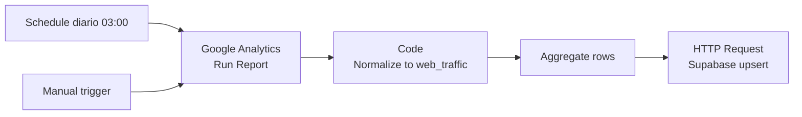

# Setup del workflow: GA4 Web Traffic Sync

Workflow N8N que cada día (3 AM) trae los últimos 30 días de tráfico web
desde Google Analytics 4 y lo escribe en la tabla `web_traffic` de Supabase.

## Arquitectura

## Lo que importa para el funnel

El funnel del dashboard joinea `ads_performance` con `web_traffic` por
`(fecha, utm_source, utm_medium, utm_campaign)`. Para que el join funcione:

- En GA4 tenés que tener **UTMs consistentes** con las que ponés en tus ads
  (ver [`utm-conventions.md`](./utm-conventions.md)).
- El workflow normaliza UTMs a lowercase kebab-case automáticamente, así que
  podés tener variaciones menores en GA4 y van a coincidir igual.
- Tráfico orgánico/direct (sin UTMs) llega como `(direct)` / `(none)` desde
  GA4 — el workflow lo convierte a `NULL` para que no contamine el join.

## Pre-requisitos

- Workflow de planning ya funcionando (mismo patrón, mismas env vars o
  hardcodeadas según tu plan de n8n.cloud).
- Acceso a tu cuenta de Google Analytics 4.
- El **Property ID** de tu propiedad GA4 (9 dígitos, todo número).

## Paso 1 — Conseguir el GA4 Property ID

1. Andá a https://analytics.google.com.
2. Click en **⚙ Admin** (engranaje abajo a la izquierda).
3. Columna **Property** (la del medio), arriba.
4. Vas a ver:
   - **Property name**: el nombre legible (ej: "Mi Marca Web")
   - **PROPERTY ID**: ⬅ este número de 9 dígitos es lo que querés copiar.

> ⚠️ NO confundir con:
>   - **Measurement ID** (empieza con `G-`): se usa para el tag en la web, no para la API.
>   - **Property name**: el alias legible.
>   - **Account ID**: identifica la cuenta, no la propiedad.

## Paso 2 — Importar el workflow

1. Bajate `ga4-web-traffic-sync.json` desde el repo (botón "Download raw file").
2. En n8n.cloud: **Workflows → Create Workflow → ⋮ → Import from File**.
3. Renombralo a **GA4 Web Traffic Sync** y guardalo.

## Paso 3 — Pegar el Property ID

1. Doble-click en el nodo **"GA4 — Run Report"**.
2. En el campo **Property ID** vas a ver el placeholder `REPLACE_WITH_YOUR_GA4_PROPERTY_ID`.
3. Reemplazá ese texto por tu número de 9 dígitos.
4. Verificá que el resto esté así:
   - **Resource**: Report
   - **Operation**: Get (o "Run Report" según versión del nodo)
   - **Date Ranges**: `30daysAgo` a `yesterday`
   - **Dimensions**: `date`, `sessionSource`, `sessionMedium`, `sessionCampaignName`
   - **Metrics**: `sessions`, `totalUsers`, `newUsers`, `conversions`, `bounceRate`, `averageSessionDuration`, `screenPageViews`
5. **No cerrés el panel** — vamos a conectar la credencial en el siguiente paso.

## Paso 4 — Conectar Google Analytics

1. En el mismo panel del nodo GA4, en **Credential to connect with**, click
   en el dropdown → **+ Create new credential**.
2. Tipo: **Google Analytics OAuth2 API**.
3. Click en **Sign in with Google**.
4. Elegí la cuenta de Google que **tiene acceso a la propiedad GA4** y dale Permitir.
5. Guardá la credencial.

## Paso 5 — Configurar Supabase

Idéntico al workflow de planning. Dos opciones según tu plan:

### Opción A — Variables de entorno (Pro/Enterprise/self-hosted)

Las mismas que ya configuraste para el workflow de planning:
- `SUPABASE_URL`
- `SUPABASE_SERVICE_ROLE_KEY`

No tocás nada en el nodo de Supabase.

### Opción B — Hardcodear (Starter/Free)

En el nodo **"Supabase — Upsert web_traffic"**:

1. Campo **URL**: reemplazar `{{ $env.SUPABASE_URL }}` por `https://TU-PROJECT.supabase.co`.
2. Headers:
   - `apikey`: pegar `sb_secret_...` directo.
   - `Authorization`: `Bearer sb_secret_...`.

## Paso 6 — Probar

1. Click en el nodo **Manual trigger** → **Execute workflow**.
2. Los nodos van a pasar a verde:
   - GA4 — Run Report ✅ (devuelve N filas con dimensiones y métricas)
   - Normalize ✅ (mismo N o menos si hubo fechas inválidas)
   - Aggregate ✅
   - Supabase upsert ✅ con status 201/200.
3. **Verificar en Supabase**: Table Editor → `web_traffic`. Vas a ver filas
   con `utm_source`, `utm_medium`, `utm_campaign`, `sesiones`, etc.
4. **Verificar en el dashboard**: abrí `/overview` y `/funnel` — los KPIs
   de Sesiones, CTR, click-to-session, CVR deberían actualizarse con tu
   data real.

## Paso 7 — Activar el schedule

1. Toggle del workflow a **Active** (arriba a la derecha).
2. Va a correr cada día a las 3 AM trayendo los últimos 30 días.
3. Los datos viejos se sobreescriben (idempotente vía upsert), los nuevos
   se insertan.

## Troubleshooting

### "Permission denied" o 403 desde GA4
La cuenta de Google que autorizaste no tiene acceso a la propiedad. Verificá
en **GA4 → Admin → Property Access Management** que tu usuario aparezca con
al menos rol "Viewer".

### El report devuelve 0 filas
- La propiedad puede no tener data en los últimos 30 días (propiedad nueva).
- Las dimensiones `sessionSource` / `sessionMedium` solo se popularon a partir
  de algún momento. Si tu propiedad es muy vieja, probá con `firstUserSource`
  como alternativa.

### Filas con `utm_source = "(direct)"` se pierden
Es esperado: el workflow las convierte a `NULL` porque el funnel no las usa
para joinear con ads. Si querés guardarlas igual para reportes de tráfico
directo, sacá la conversión a `null` del Code node y dejá `(direct)` como
viene de GA4.

### Diferencias con los reportes en la UI de GA4
GA4 puede tardar 24-72hs en consolidar datos. Los reportes que corren a las
3 AM toman datos del día anterior cuando ya están casi finales. Si comparás
con la UI de GA4 a media mañana, puede haber pequeñas discrepancias que se
resuelven en la corrida del día siguiente.

### `conversions` siempre devuelve 0
GA4 considera "conversiones" solo a los **eventos marcados como conversión**
en **Admin → Events → Mark as conversion**. Si no marcaste ninguno, el dato
viene en 0. Marcá los eventos relevantes (purchase, sign_up, contact, etc.)
y rerun.

### Cambio de "conversions" a "keyEvents" en GA4 2025
Google renombró "Conversions" a "Key events" en early 2025. La métrica
`conversions` sigue funcionando como alias por compatibilidad. Si en el
futuro deprecan, hay que cambiar `conversions` → `keyEvents` en el nodo y
en el Code node.
