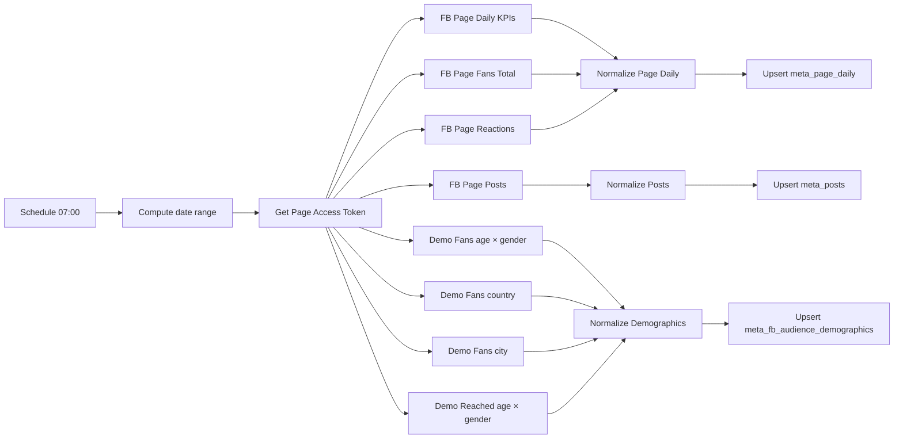

# Setup del workflow: Meta FB Comprehensive Sync

Workflow N8N que cada día (7 AM) trae datos **completos de Facebook Page orgánico** (Drean):

- KPIs diarios: alcance, impresiones, reacciones tipadas, engagement, page views, fans delta
- Posts individuales con métricas snapshot
- **Demografía**: fans por edad×género, países y ciudades (lifetime), público alcanzado por edad×género (diario)

## Por qué FB sí funciona y IG no (estado actual)

En el setup actual de Drean, el System User Token del BM **tiene acceso completo a la Page Drean** (FB), pero **NO** a @dreanargentina (IG) — esa cuenta IG está como "asset visible" en el BM pero su propiedad técnica vive en otro BM. Por eso FB se automatiza ahora y IG queda pendiente hasta que se resuelva la propiedad.

## Tablas que llena

- `meta_page_daily` — KPIs diarios de la Page (creada en migration 0027, extendida con campos nuevos en 0029)
- `meta_posts` (filas con `platform = 'facebook'`) — posts con insights
- `meta_fb_audience_demographics` — formato long flexible (creada en migration 0029)

## Arquitectura

## Pre-requisitos

- Migration `0029_meta_fb_audience.sql` aplicada en Supabase (asume que también está la 0027 base)
- System User Token de Meta válido con scopes:
  - `pages_show_list`
  - `pages_read_engagement`
  - `read_insights`
  - `business_management`
- System User del BM Alladio - Negocio Drean con asset asignado: **Páginas → Drean (Acceso total)**

## Paso 1 — Aplicar migrations

En el SQL Editor de Supabase, correr (en orden si no se aplicaron antes):

- `0027_meta_organic.sql` (si todavía no se aplicó)
- `0029_meta_fb_audience.sql`

Ambas son idempotentes (`add column if not exists`, `create table if not exists`).

## Paso 2 — Importar el workflow

1. Bajate `n8n-workflows/meta-fb-sync.json` del repo
2. En n8n.cloud: **Workflows → Import from File**
3. Renombrá a **"Meta FB Comprehensive Sync"** y guardá

## Paso 3 — Configurar la credencial

El workflow usa el endpoint `/me/accounts` para extraer dinámicamente el **Page Access Token** y después lo pasa como query param a las demás requests. Necesitás configurar **una sola credencial Facebook Graph API** en el primer HTTP node ("Get Page Access Token") con el System User Token actual.

1. Click en el nodo **"Get Page Access Token"**
2. Authentication: **Predefined Credential Type**
3. Credential Type: **Facebook Graph API**
4. **+ Create new credential** → pegar el System User Token de Meta en el campo Access Token → Save

Los otros HTTP nodes NO necesitan credencial — el token de Page se pasa como query param desde el Extract Page Token node.

## Paso 4 — Verificar Page ID en el código

Los Code nodes ("Extract Page Token", "Normalize Page Daily", "Normalize Posts", "Normalize Demographics") tienen el Page ID hardcodeado como constante `PAGE_ID = '257587170945975'`. Si cambiás de Page o testeás con otra, actualizá esa constante en los 4 nodos.

## Paso 5 — Configurar Supabase

Los 3 nodos `Supabase — Upsert ...` usan env vars `SUPABASE_URL` y `SUPABASE_SERVICE_ROLE_KEY`. Configurar en n8n.cloud Settings → Variables (plan Pro+) o hardcodear los valores en cada uno de los 3 nodos (plan Starter).

## Paso 6 — Probar

1. Click en **Manual trigger** → **Execute Workflow**
2. Esperar ~30-60 segundos
3. Branches que deben pasar verdes:
   - Get Page Access Token ✅ → debería devolver Pages con access_token (incluyendo Drean)
   - Extract Page Token ✅
   - Los 8 branches de HTTP en paralelo ✅
   - Los 3 Normalize nodes ✅
   - Los 3 Supabase Upsert nodes ✅ (status 201/200)
4. Verificar en Supabase Table Editor:
   - `meta_page_daily`: ~30 filas (una por día)
   - `meta_posts` (filtrar `platform='facebook'`): cantidad variable según posteo de Drean
   - `meta_fb_audience_demographics`: muchas filas (fans + reached)

## Paso 7 — Verificar en el dashboard

Abrir `/redes` → debería aparecer arriba la sección **"Facebook orgánico — Page Drean"** con KPIs, demografía y top posts.

## Paso 8 — Activar el schedule

Toggle **Active** en el workflow. Corre 7 AM diario con ventana de 30 días móviles. Idempotente vía upsert.

## Troubleshooting

### `(#190) This method must be called with a Page Access Token`
El nodo "Get Page Access Token" no devolvió bien el token. Verificá que el System User Token tenga `pages_show_list` y `pages_read_engagement`, y que el system user tenga la Page Drean asignada como asset.

### `(#100) Invalid metric: page_consumptions`
Algunas métricas fueron renombradas o deprecadas en versiones más nuevas del Graph API. Si una falla, sacala del query string del HTTP node y del Normalize correspondiente. Las más estables son `page_impressions`, `page_impressions_unique`, `page_engaged_users`, `page_fans`, `page_post_engagements`.

### Demografía vacía
- `page_fans_*` requiere que la Page tenga >100 fans (Drean tiene 128k, OK)
- `page_impressions_by_*` requiere que haya impresiones en el período (es lógico, si la Page no postea no hay reached audience)
- Si la Page es muy pequeña, Meta puede ocultar buckets para preservar anonimato

### Out of memory en n8n.cloud Starter
- Bajar Date Range a `7daysAgo`
- `page_impressions_by_age_gender_unique` con 30 días puede generar 30 × ~12 buckets = ~360 filas. Manejable.

### Quiero también demografía de reached por country/city
Duplicar los nodos "Demo — Reached (age × gender)" cambiando el `metric` a:
- `page_impressions_by_country_unique`
- `page_impressions_by_city_unique`

El Code node "Normalize Demographics" ya soporta esos nombres (chequear la constante `REACHED_METRICS`).
