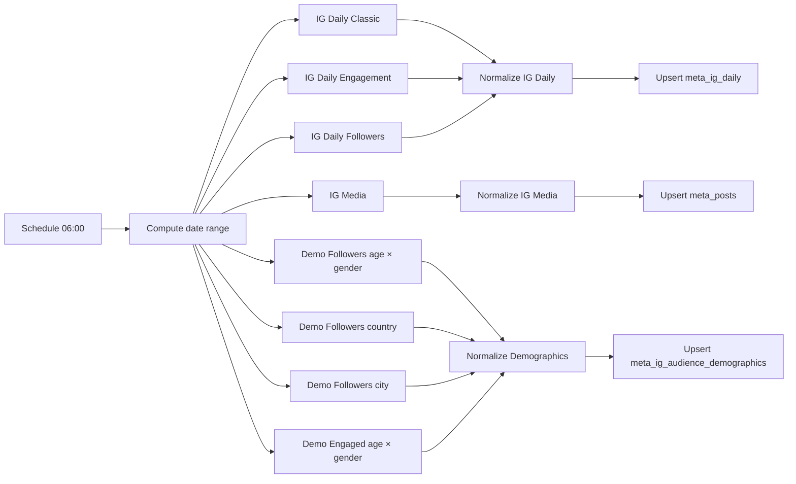

# Setup del workflow: Meta IG Comprehensive Sync

Workflow N8N que cada día (6 AM) trae datos **completos de Instagram orgánico** de @dreanargentina:

- KPIs diarios: alcance, impresiones, likes, comments, saves, shares, total interactions, profile views, followers
- Posts individuales con todas sus métricas
- **Demografía del público** (follower y engaged): edad × género, países, ciudades

Reemplaza/complementa el `meta-organic-sync.json` para la parte de Instagram. Lo orgánico de Facebook sigue en ese workflow.

## Tablas que llena

- `meta_ig_daily` — KPIs diarios de la cuenta IG (migration 0027 + columnas nuevas de 0028)
- `meta_posts` (filas con `platform = 'instagram'`) — posts con métricas snapshot
- `meta_ig_audience_demographics` — formato long flexible con breakdowns

## Arquitectura

## Pre-requisitos

- Migration `0028_meta_ig_audience.sql` aplicada en Supabase (asume que ya corriste `0027_meta_organic.sql`).
- Credencial Facebook Graph API OAuth2 en n8n con los scopes:
  - `instagram_basic`
  - `instagram_manage_insights`
  - `pages_show_list` (necesario para que Meta vincule la IG con la Page)
  - `pages_read_engagement`
- Instagram Business o Creator account (Drean ya lo es).

## Paso 1 — Aplicar la migration

En el SQL Editor de Supabase, correr `0028_meta_ig_audience.sql`. Es
idempotente: usa `add column if not exists`, `create table if not exists`.

## Paso 2 — Importar el workflow

1. Bajate `n8n-workflows/meta-ig-sync.json` del repo.
2. En n8n.cloud: **Workflows → Import from File**.
3. Renombralo a **Meta IG Comprehensive Sync** y guardalo.

## Paso 3 — Reemplazar placeholder de IG User ID

El JSON tiene `REPLACE_IG_USER_ID` en 8 nodos HTTP + 3 Code nodes. La forma rápida:

1. Antes de importar, abrí el JSON en un editor.
2. **Find & Replace**: `REPLACE_IG_USER_ID` → `17841404990509161`
3. Guardá y reimportá.

O reemplazá manualmente en cada nodo después de importar.

## Paso 4 — Conectar OAuth

Reusá la credencial Facebook Graph API que ya creaste para `meta-organic-sync` (si la creaste). Si no:

1. En cualquier HTTP node → Credential → **+ Create new** → Facebook Graph API OAuth2 → Sign in with Facebook → autorizar scopes.
2. Asignar la misma credencial en los 8 HTTP nodes del workflow.

## Paso 5 — Configurar Supabase env vars

Si no las tenés ya en n8n.cloud (de los otros workflows): `SUPABASE_URL` y `SUPABASE_SERVICE_ROLE_KEY`.

En Starter sin env vars → hardcodear en los 3 nodos `Supabase — Upsert ...`.

## Paso 6 — Probar

1. **Execute Workflow** manual.
2. Esperar los 8 branches (los demographics pueden tardar más).
3. Verificar en Supabase:
   - `meta_ig_daily` tiene filas con `likes, comments, saves, shares` no-cero
   - `meta_posts` filtrando `platform='instagram'` muestra posts con métricas
   - `meta_ig_audience_demographics` tiene filas con `audience_type, dimension, category`

## Paso 7 — Verificar en dashboard

Abrir `/redes` → debería aparecer la sección **"Instagram orgánico — @dreanargentina"** ARRIBA de todo el resto, con KPIs y breakdowns demográficos.

## Paso 8 — Activar schedule

Toggle **Active**. Corre 6 AM diario.

## Troubleshooting

### `(#100) The value must be a valid insights metric: likes`
Algunas métricas nuevas requieren versión más alta del Graph API (v18+) y cuentas IG verificadas. Si tu instancia falla:
- Cambiar la URL de v18.0 a v19.0 o v20.0 en los HTTP nodes.
- Si persiste, sacar la métrica problemática del query y del Code node correspondiente.

### `(#100) param breakdown must be one of the following values`
La API de demographics solo acepta ciertos breakdowns:
- `age,gender` (combinados) o `age` / `gender` por separado.
- `country` (ISO code).
- `city` (nombre).
No funciona `breakdown=age,gender,country` (más de 2 dimensiones).

### Demographics vienen vacíos
- `follower_demographics` requiere >= 100 followers (Drean tiene 144k, OK).
- `engaged_audience_demographics` requiere ventana con engagement suficiente; si la cuenta está dormida puede venir vacío.
- Si solo `engaged_*` viene vacío, el dashboard lo muestra con un placeholder; no es un bug.

### Out of memory en n8n.cloud Starter
- Bajar el Date Range a `7daysAgo` para las queries que traen series diarias.
- Si IG Media trae demasiados posts, bajar `limit=50` en el HTTP node.

### Quiero también reached_audience_demographics
La API tiene `reached_audience_demographics` además de `engaged_*`. Para agregarlo:
1. Duplicar el nodo "Demo — Engaged (age × gender)".
2. Cambiar `metric` a `reached_audience_demographics`.
3. El Code node `Normalize Demographics` ya soporta el tipo `'reached'` automáticamente.
