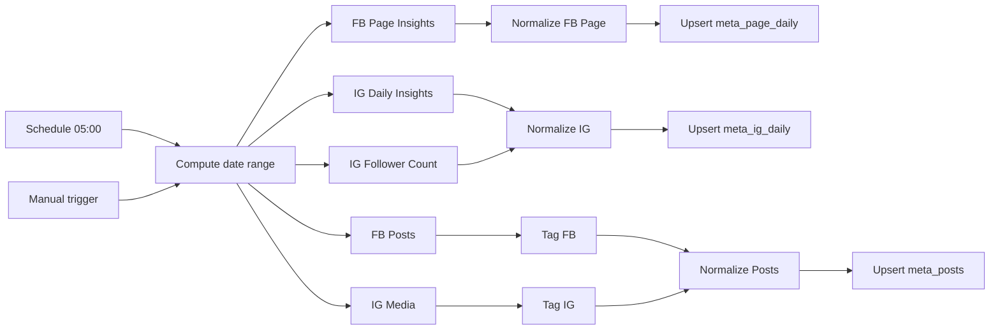

# Setup del workflow: Meta Organic Sync (FB Page + IG)

Workflow N8N que cada día (5 AM) trae datos **orgánicos** de Facebook Page
e Instagram Business desde el Graph API de Meta y los escribe en tres
tablas de Supabase. **No incluye ads pagas** — ese requiere acceso a la
Ad Account, que en el setup actual del usuario administrador todavía no
está concedido.

## Tablas que llena

- `meta_page_daily` → métricas diarias de la Page de Facebook (impresiones,
  reach, engagement, fans, post_engagements, etc.)
- `meta_ig_daily` → métricas diarias de la cuenta de Instagram Business
  (reach, impressions, follower_count, profile_views, etc.)
- `meta_posts` → posts individuales (FB + IG) con métricas snapshot.

## Arquitectura

## Pre-requisitos

- Migration `0027_meta_organic.sql` aplicada en Supabase.
- Acceso al Business Manager de Drean (no hace falta Admin, alcanza con
  acceso a la Page de FB y la cuenta de IG Business).
- IDs de Drean ya identificados:
  - **Business Manager ID**: `122350585916257` (Alladio - Negocio Drean)
  - **Facebook Page ID**: `257587170945975`
  - **Instagram User ID**: `17841404990509161`

## Paso 1 — Aplicar la migration

En el SQL Editor de Supabase, correr `0027_meta_organic.sql`. Es idempotente.

## Paso 2 — Importar el workflow

1. Bajate `n8n-workflows/meta-organic-sync.json` del repo.
2. En n8n.cloud: **Workflows → Import from File**.
3. Renombralo a **Meta Organic Sync (FB Page + IG)** y guardalo.

## Paso 3 — Reemplazar placeholders de IDs

El JSON tiene tres placeholders que hay que sustituir. La forma más
rápida es **Find & Replace** sobre el JSON antes de importar, o tocarlos
nodo por nodo después.

| Placeholder | Reemplazar por |
|---|---|
| `REPLACE_PAGE_ID` | `257587170945975` |
| `REPLACE_IG_USER_ID` | `17841404990509161` |

Aparecen en:
- URL de los HTTP nodes (FB Page Insights, IG insights, FB Posts, IG Media)
- Code nodes "Normalize FB Page" y "Normalize IG" y "Normalize Posts"
  (constantes `pageId`, `igId`).

> 💡 Si más adelante manejás varias Pages / cuentas IG, mover esos IDs a
> environment variables (`META_PAGE_ID`, `META_IG_USER_ID`) y referenciar
> con `{{ $env.META_PAGE_ID }}`.

## Paso 4 — Conectar Facebook Graph API (OAuth)

1. En cualquiera de los HTTP nodes del workflow, en **Credential to connect with**
   click en **+ Create new credential**.
2. Tipo: **Facebook Graph API OAuth2**.
3. Click en **Sign in with Facebook**.
4. Login con tu cuenta personal de Facebook (la que tiene acceso al BM de Drean).
5. En el prompt de permisos, **autoriza todos los scopes que pida n8n**.
   Los esenciales son:
   - `pages_read_engagement` → leer insights de la Page
   - `pages_show_list` → listar páginas asociadas
   - `read_insights` → métricas históricas
   - `instagram_basic` → leer la cuenta de IG
   - `instagram_manage_insights` → insights de IG
6. Guardar la credencial.
7. Re-usar la misma credencial en todos los HTTP nodes del workflow.

> ⚠️ **Token longevity**: el OAuth de n8n con la cuenta personal genera un
> token que dura ~60 días. Antes de que expire vas a tener que volver a
> hacer "Sign in with Facebook". Si querés tokens que nunca expiran, hay
> que crear un **System User** en el BM — eso requiere rol de Admin
> completo en el portafolio (que actualmente no tenés).

## Paso 5 — Configurar Supabase (mismo patrón que otros workflows)

Si ya configuraste `SUPABASE_URL` y `SUPABASE_SERVICE_ROLE_KEY` como env
vars en n8n.cloud (Pro+) → no hay que tocar nada.

Si estás en Starter → hardcodear los valores en cada uno de los 3 nodos
HTTP `Supabase — Upsert ...`.

## Paso 6 — Probar

1. **Execute Workflow** (botón naranja).
2. Verde esperado:
   - FB Page Insights ✅ → Normalize FB Page ✅ → Upsert meta_page_daily ✅
   - IG Daily Insights ✅ + IG Follower Count ✅ → Normalize IG ✅ → Upsert meta_ig_daily ✅
   - FB Posts ✅ → Tag FB → Normalize Posts ✅ → Upsert meta_posts ✅
   - IG Media ✅ → Tag IG → Normalize Posts ✅
3. En Supabase → Table Editor → verificar filas en las 3 tablas.

## Paso 7 — Activar el schedule

Toggle **Active** en el workflow. Corre a las 5 AM con ventana de 30 días.
Idempotente vía upsert.

## Troubleshooting

### `(#100) The value must be a valid insights metric`
La API de Meta deprecó alguna métrica. Las que más se renombran:
- `page_consumptions` → puede no estar disponible para Pages nuevas.
- `page_video_views` → en algunas versiones es `page_video_views_total`.
- Solución: sacá esa métrica del query string del HTTP node y del Normalize
  correspondiente, o cambiá a la versión nueva.

### `(#10) Application does not have permission`
La credencial OAuth no tiene los scopes necesarios. Editá la credencial
en n8n → "Edit" → "Re-authorize" y aceptá todos los permisos en el prompt
de Facebook.

### `(#200) Permissions error` en FB Posts
El permiso `pages_manage_posts` no se concedió. Re-autorizar.

### Insights de IG vienen vacíos
La cuenta de IG tiene que ser **Business** o **Creator** (no Personal).
@dreanargentina ya es Business (tiene check verificado), así que esto
no debería pasar.

### Token expiró antes de 60 días
Puede pasar si el usuario cambia password de Facebook o revoca permisos.
Solución: re-autorizar la credencial.

### Necesito Ad Account performance también
Pedir al admin del BM que asigne tu usuario a la Ad Account con rol
**Analyst** o **Advertiser**. Después se agrega una rama nueva al workflow
con el endpoint `/v18.0/act_{AD_ACCOUNT_ID}/insights` y una tabla
`meta_ads_performance` (en otra migration).
