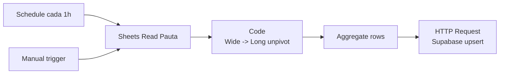

# Setup del workflow: Sheets Planning Media (Drean Pauta)

Workflow N8N que cada hora lee el Google Sheet de pauta de Drean (formato
wide con 12 columnas de meses) y lo desempivota en la tabla
`planning_media` de Supabase (formato long, una fila por mes).

## Flujo mensual del usuario

```
CSV mensual de OMD ─┐
                    ├─→ pegar en Sheet Drive ─→ N8N sync (cada 1h) ─→ Supabase ─→ /planning
CSV mensual de TVC ─┤
CSV mensual OOH ────┤
CSV costos ─────────┘
```

Vos generás los CSVs como ya lo hacés, los pegás en el Sheet único de Drive
("Pauta-omd"), y el dashboard se actualiza en máximo 1 hora.

## Arquitectura



## Pre-requisitos

- Migración aplicada: `supabase/migrations/0004_planning_media.sql`.
- Tu Sheet "Pauta-omd" en Drive con la estructura wide-format de OMD.
- Credencial Google Sheets OAuth2 ya conectada en N8N.

## Paso 1 — Aplicar la migración

1. Supabase → **SQL Editor → New query**.
2. Pegá el contenido de `supabase/migrations/0004_planning_media.sql`.
3. Run. Verificá que aparezca `planning_media` en Table Editor + las 2 vistas:
   `vw_planning_media_mensual` y `vw_planning_media_por_categoria`.

## Paso 2 — Preparar el Sheet

El workflow espera un Sheet con **una sola pestaña** llamada **`Pauta`**
(o ajustá el nombre en el nodo "Google Sheets — Read Pauta"). La fila 1
son los headers, exactamente como OMD los entrega:

| Campaña | Rol Of Comms | TouchPoint | Sistema | Formato & Channel | Enero | Febrero | Marzo | Abril | Mayo | Junio | Julio | Agosto | Septiembre | Octubre | Noviembre | Diciembre |

**Convenciones**:

- Columna `Campaña`: Brand, Cocina, Refrigeración, Lavado, Promoción, UGC, etc.
- Columna `Rol Of Comms`: `Build` o `Consider` (líneas de costo dejan vacío).
- Columna `Sistema`: YouTube, Meta, TikTok, OOH, TVC, TVA, Mercado Ads,
  Prog. Video, Diarios Online, etc. **Para TV Cable usar `TVC` o `TVA`.**
  **Para vía pública usar `OOH`**.
- Columna `Formato & Channel`: nombre del formato (Bumper, TrueView, etc.) o
  nombre del costo (PERCEPCIÓN IIBB, Impuesto al cheque, Tech Fee, Comisión Agencia).
- Columnas de mes: valores en pesos como `$ 1.234.567` o `$1234567`. El
  workflow parsea ambos formatos. Celdas vacías o `$-` se ignoran.
- Filas con `Sistema` o `Formato` que empiezan con "Total" o "Subtotal" se
  saltean (son agregados visuales, no data).
- **El año** está cableado a 2026 en el Code node. Para cambiar (2027), editá
  la constante `YEAR` en el nodo "Unpivot wide -> long".

## Paso 3 — Importar el workflow

1. Bajate `n8n-workflows/sheets-planning-media-sync.json` del repo.
2. N8N → **Workflows → Create → ⋮ → Import from File**.
3. Renombrá a **"Sheets Planning Media Sync (Drean Pauta)"**.

## Paso 4 — Configurar el nodo Sheets

1. Doble-click en **"Google Sheets — Read Pauta"**.
2. Credencial: tu OAuth2 de Google Sheets.
3. Document: reemplazá `REPLACE_WITH_DREAN_PAUTA_SHEET_ID` por el ID de tu
   Sheet "Pauta-omd" (lo sacás de la URL entre `/d/` y `/edit`).
4. Sheet: el nombre de la pestaña con tu data (default: `Pauta`).
5. **Header Row**: 1.

## Paso 5 — Configurar Supabase

Mismas dos opciones que los otros workflows:

### A) Variables de entorno (Pro/Enterprise)

`SUPABASE_URL` y `SUPABASE_SERVICE_ROLE_KEY` ya configuradas.

### B) Hardcodear (Starter/Free)

En el nodo **"Supabase — Upsert planning_media"**:

- **URL**: `https://TU-PROJECT.supabase.co/rest/v1/planning_media?on_conflict=fecha,campania,rol,sistema,formato,tipo`
- **Headers**: `apikey` y `Authorization: Bearer` con tu `sb_secret_...` key.

## Paso 6 — Probar

1. Save.
2. Click **Manual trigger → Execute workflow**.
3. Mirá el output del nodo "Unpivot wide -> long" — debería tener varias
   filas (una por mes × línea de pauta con inversión > 0).
4. **Supabase Table Editor → `planning_media`** → debería tener tus filas.
5. **Dashboard** `/planning` → debería mostrar la pauta del mes en curso con
   todos los KPIs, donuts, charts y tablas.

## Paso 7 — Activar el schedule

Toggle a **Active**. Cada hora N8N relee el Sheet y sincroniza cambios.

## Flujo mensual recurrente

Una vez que está todo configurado, tu workflow es:

1. OMD te manda los CSVs del mes (Digital, TVC, OOH, Costos).
2. Abrís el Sheet "Pauta-omd" en Drive.
3. Pegás las filas del CSV en la pestaña `Pauta` (después de las que ya tenés).
4. Esperás 1h (o forzás Execute en N8N).
5. El dashboard `/planning` muestra la pauta actualizada.

## Notas para Drean en particular

- El dashboard por default muestra **el mes con data más reciente**. Si
  cargás Mayo, el dashboard arranca en Mayo. Cambiás de mes con el filtro.
- Las categorías visualizadas usan la paleta del HTML original:
  `Brand`=#3b82f6, `Cocina`=#f97316, `Refrigeración`=#22c55e, `Lavado`=#a78bfa,
  `Promoción`=#facc15, `UGC`=#f43f5e. Si OMD agrega una categoría nueva,
  aparece con color default gris — editá `PALETA_CATEGORIA` en
  `apps/web/src/lib/planning-media-queries.ts`.

## Troubleshooting

### El dashboard sigue vacío
Verificá en Supabase que `planning_media` tenga filas. Si tiene pero el
dashboard dice "Sin datos", probablemente el filtro de mes está fijado a un
mes sin data — borrá el query param `mes` de la URL.

### Aparecen filas duplicadas
El unique constraint `(fecha, campania, rol, sistema, formato, tipo)` debería
prevenirlo. Si pasa, hay variaciones en los strings (espacios, mayúsculas).
Limpiá el Sheet y volvé a correr.

### Costos no aparecen separados
El detector de costos busca patrones `iibb`, `cheque`, `tech fee`, `comisi`
en el campo `Formato & Channel`. Si OMD usa otro nombre, agregalo a
`COSTO_PATTERNS` en el Code node.
