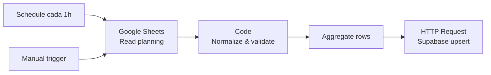

# Setup del workflow: Sheets Planning Sync

Workflow N8N que cada hora lee un Google Sheet con el planning de marketing
y lo escribe en la tabla `planning` de Supabase.

## Arquitectura



- **2 triggers** (schedule + manual): el schedule corre solo cada hora, el
  manual sirve para que vos lo dispares cuando querés probar.
- **Read** levanta toda la pestaña `planning` del Sheet.
- **Normalize & validate** (Code node): lowercase enums, parsea fechas y
  números, descarta filas inválidas (loguea pero no rompe).
- **Aggregate** junta todas las filas en un solo array (necesario para que el
  upsert sea una sola request HTTP en vez de N requests).
- **Supabase upsert** llama al endpoint REST con `Prefer: resolution=merge-duplicates`
  usando el unique constraint `(fecha, canal, campania, metric_type)`.

## Pre-requisitos

- Cuenta en https://n8n.cloud
- El Sheet de planning creado con la estructura de [`planning-sheet-template.md`](./planning-sheet-template.md)
- Las keys de Supabase del proyecto

## Paso 1 — Crear el Sheet de planning

1. Andá a https://drive.google.com.
2. **New → Google Sheets** (hoja en blanco).
3. Nombrala **"Planning Marketing"** (o como quieras, el nombre va en el workflow).
4. Renombrá la pestaña inferior de **"Sheet1"** a **`planning`** (doble click).
5. En la fila 1, pegá estos 7 encabezados — uno por columna, de A a G:

   ```
   fecha   canal   campania   inversion_plan   kpi_target   metric_type   notas
   ```

6. **Formato de columnas**:
   - Columna `fecha`: seleccionala → **Format → Number → Date**.
   - Columnas `inversion_plan` y `kpi_target`: seleccionalas → **Format → Number → Number**.
7. Agregá 3-5 filas de prueba (mirá [`planning-sheet-template.md`](./planning-sheet-template.md) para ejemplos).
8. Copiá el **Sheet ID** de la URL — está entre `/d/` y `/edit`:

   ```
   https://docs.google.com/spreadsheets/d/1aBcD...Eg9hI/edit#gid=0
                                          └──────┬──────┘
                                              Sheet ID
   ```

## Paso 2 — Importar el workflow a N8N

1. Login a tu workspace en https://n8n.cloud.
2. En el menú lateral, **Workflows** → **Add workflow** → al lado del nombre
   click en `⋮` → **Import from File**.
3. Seleccioná `n8n-workflows/sheets-planning-sync.json` del repo
   ([link directo](https://github.com/dsabena-byte/dashboard-mkt/blob/main/n8n-workflows/sheets-planning-sync.json) → botón **Download raw file**).
4. Vas a ver los 6 nodos en el canvas. Algunos van a estar en rojo porque les
   faltan credenciales — eso lo arreglamos abajo.

## Paso 3 — Configurar variables de entorno en N8N

El workflow lee las keys de Supabase desde variables de entorno (no hardcodeadas
en el JSON, para que el archivo en GitHub no tenga secretos).

1. En n8n.cloud, **Settings → Variables** (o **Environment** según el plan).
2. Agregá 2 variables:

   | Variable                       | Valor                                                      |
   |--------------------------------|------------------------------------------------------------|
   | `SUPABASE_URL`                 | `https://vtcrhyyirqexczycuwhe.supabase.co`                |
   | `SUPABASE_SERVICE_ROLE_KEY`    | `sb_secret_...` (la secret key que ya generaste)           |

   ⚠️ Si tu plan de n8n.cloud no soporta variables de entorno, hay un plan B:
   reemplazá las referencias `{{ $env.VARIABLE }}` en el nodo "Supabase — Upsert
   planning" directamente con los valores. Es menos limpio pero funciona.

## Paso 4 — Conectar Google Sheets

1. En el canvas, doble-click en el nodo **"Google Sheets — Read planning"**.
2. En **Credentials**, click en el dropdown → **+ Create New Credential**.
3. Elegí **Google Sheets OAuth2 API**.
4. Click en **Connect my account** → autorizá con tu cuenta de Google.
5. Guardá la credencial con el nombre `Google Sheets account`.
6. Volvé al nodo. En **Document** vas a poder seleccionar tu Sheet "Planning Marketing"
   del dropdown (puede tardar unos segundos en cargar la lista).
7. En **Sheet** seleccioná la pestaña `planning`.
8. Click en **Execute step** para probar — deberías ver las filas del Sheet
   como output, listas para el siguiente nodo.

## Paso 5 — Probar el workflow completo

1. Click en el nodo **"Manual trigger"** → botón **Execute workflow** (arriba).
2. Vas a ver los nodos pasar a verde uno por uno.
3. Si el último (Supabase Upsert) queda en verde con respuesta `201` o `200`,
   funcionó.
4. **Verificá en Supabase**: andá al **Table Editor → planning** y deberías
   ver las filas que pusiste en el Sheet. Si modificaste alguna existente,
   debería estar actualizada.
5. **Verificá en el dashboard**: abrí tu deploy de Vercel y la página
   `/planning` debería mostrar la data nueva.

## Paso 6 — Activar el schedule

Hasta ahora solo corre cuando vos apretás "Execute workflow". Para que corra
sola cada hora:

1. En el canvas, arriba a la derecha, toggle de **Active** a **ON**.
2. Listo. El nodo "Schedule (hourly)" ahora dispara una ejecución por hora.

## Troubleshooting

### "Could not find credentials" en el nodo de Sheets
La credencial no se importó (las creds nunca van en el JSON exportado). Volvé
al Paso 4 y conectala desde cero.

### Error 401 en el nodo de Supabase
La `SUPABASE_SERVICE_ROLE_KEY` está mal o no se está expandiendo. Probá poner
el valor directo (sin `$env`) y verificá que es la **secret key**, no la
publishable. Las dos empiezan con `sb_` pero solo la secret bypassa RLS.

### Error 409 "duplicate key" en Supabase
El nodo no está mandando el header `Prefer: resolution=merge-duplicates`.
Verificá que en el nodo "Supabase — Upsert planning" la sección **Headers**
tenga las 4 entradas (apikey, Authorization, Content-Type, Prefer).

### Algunas filas no llegan a Supabase
Probablemente validación: abrí la ejecución → click en el nodo "Normalize & validate"
→ tab "Logs". Vas a ver qué filas se descartaron y por qué (canal o metric_type
inválidos son los más comunes).

### El Schedule no dispara
- Verificá que el workflow esté **Active** (toggle arriba a la derecha en verde).
- Verificá que el nodo "Schedule (hourly)" no tenga errores rojos.
- En la pestaña **Executions** del workflow vas a ver el historial. Si el
  schedule corrió debería aparecer ahí cada hora.

## Próximos workflows

Cuando este esté funcionando estable, replicamos la misma estructura para:

- `sheets-social-sync` — el Sheet del scraper de RRSS existente → `social_metrics` + `social_competitor`
- `gads-ingest-daily` — Google Ads API → `ads_performance`
- `meta-ingest-daily` — Meta Marketing API → `ads_performance`
- `ga4-ingest-daily` — GA4 Reporting API → `web_traffic`
