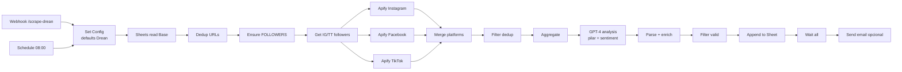

# Setup del scraper de RRSS para Drean

Workflow N8N adaptado del **Scrapper-Pro** de Tombaio para el caso de uso de
Drean. Scrapea Instagram, Facebook y TikTok de Drean + competidores, los
analiza con GPT-4 (pilar de contenido + sentiment) y escribe el resultado
en un Google Sheet específico de Drean.

> **Importante**: este workflow es una **copia adaptada** del Scrapper-Pro
> de Tombaio (https://github.com/dsabena-byte/Smart-Social-AI). Las
> diferencias respecto al original están más abajo. La función de scraping +
> análisis IA es idéntica.

## Arquitectura



## Diferencias con el Scrapper-Pro original

| Aspecto                | Tombaio (original)            | Drean (este)                       |
|------------------------|-------------------------------|-------------------------------------|
| Webhook path           | `/scrape-pro`                 | `/scrape-drean`                    |
| Inputs                 | 100% desde webhook body       | Defaults Drean + webhook opcional   |
| Sheet ID               | Recibido por param            | Hardcodeado en Set Config           |
| Marcas Instagram       | Variables por cliente         | `dreanargentina`, `philco.arg`, `gafaargentina` (editable) |
| Marca propia (myBrand) | Param `myBrand`               | `dreanargentina`                    |
| Resend API key         | Hardcodeada en el JSON ⚠️     | Variable de entorno `$env.RESEND_API_KEY` |
| Email                  | Siempre intenta enviar        | Skip si `clientEmail` vacío         |
| From address           | `hola@tombaio.com`            | `notificaciones@TU-DOMINIO` (editable) |

## Pre-requisitos

- Cuenta en n8n.cloud (la que ya tenés)
- Credencial **Apify OAuth2** en n8n (la misma de Tombaio sirve si ya la tenés conectada)
- Credencial **Google Sheets OAuth2** (idem)
- Credencial / API key de **OpenAI** (la misma de Tombaio)
- Sheet de Drean creado con la pestaña **`Base`** vacía (los headers se crean al primer run)
- Migración `0003_extend_social_schema.sql` aplicada en Supabase (ya hecho ✅)

## Paso 1 — Crear el Sheet de Drean

1. Drive → **+ New → Google Sheets**.
2. Nombre: **"Drean - Social Scraping"**.
3. Renombrá la primera pestaña a **`Base`** (con B mayúscula, igual que en Tombaio).
4. **No** pongas headers — el workflow los crea automáticamente al primer run.
5. Copiá el **Sheet ID** de la URL (entre `/d/` y `/edit`).

## Paso 2 — Importar el workflow

1. Bajate `n8n-workflows/scraper-social-drean.json` del repo.
2. N8N → **Workflows → Create → ⋮ → Import from File**.
3. El workflow viene con el nombre **"Scrapper Pro — Drean (Social)"**.

## Paso 3 — Editar el Set Config

1. Doble-click en el nodo **"Set Config"**.
2. En el código vas a ver una constante `DEFAULTS` con valores prearmados.
3. **Reemplazá** `REPLACE_WITH_DREAN_SHEET_ID` por el ID real del Sheet del Paso 1.
4. **Revisá las URLs** de Instagram, Facebook y TikTok. Las que puse por default son:
   - Instagram: `dreanargentina`, `philco.arg`, `gafaargentina`
   - Facebook: `dreanargentina`, `PhilcoArgentinaOk`, `gafaargentina`
   - TikTok: `@drean.argentina`, `@philco.argentina`, `@gafa.argentina`
5. Si alguna URL de competidor es distinta, cambiala. Si querés sumar más
   competidores, agregalos al array correspondiente.
6. **Save** el workflow.

## Paso 4 — Reconectar credenciales

Al importar, las credenciales no vienen (igual que en otros workflows).
Hay 5 nodos que necesitan credencial:

- **Get row(s) in sheet** → Google Sheets OAuth2 ya creada
- **Ensure FOLLOWERS Header** → misma Google Sheets OAuth2
- **Instagram Actor** / **Facebook Actor** / **TikTok Actor** → Apify OAuth2
- **Get Follower Counts** / **Get TT Followers** → Apify OAuth2
- **GPT Analysis** → HTTP con header Authorization Bearer + tu OpenAI API key.
  Mirá el nodo "GPT Analysis" → headers → reemplazá el placeholder.
- **Append row in sheet** → Google Sheets OAuth2

Si en Tombaio ya tenés todas estas credenciales, simplemente seleccionalas
desde el dropdown de cada nodo.

## Paso 5 — Configurar variables de entorno (opcional)

Si querés que envíe email cuando termina:

- `RESEND_API_KEY`: tu key de Resend
- Editá `Send Email (Resend)` → `from` → cambiá `TU-DOMINIO` por un dominio
  verificado en Resend (ej: `drean.com`).
- En el body del webhook (o en `DEFAULTS.clientEmail` del Set Config), poné
  el email donde querés recibir el aviso.

Si NO querés email: dejá `clientEmail` vacío. El nodo va a saltearse solo.

## Paso 6 — Probar

Tenés dos formas de disparar:

### Opción A — Schedule (automático, diario 8 AM)

1. Toggle del workflow a **Active**.
2. A las 8 AM del próximo día corre solo con los `DEFAULTS`.

### Opción B — Webhook (on-demand)

```bash
curl -X POST https://TU-N8N-WORKSPACE.app.n8n.cloud/webhook/scrape-drean \
  -H "Content-Type: application/json" \
  -d '{
    "sheetId": "TU_SHEET_ID",
    "instagram": ["https://www.instagram.com/dreanargentina/", "..."],
    "facebook": ["..."],
    "tiktok": ["..."],
    "myBrand": "dreanargentina",
    "days": 30
  }'
```

### Opción C — Manual (test desde N8N)

1. Click en **Webhook Trigger** o **Schedule Trigger**.
2. Botón **▶ Execute workflow**.
3. Esperá 5-15 min (Apify tarda según volumen).
4. Verificá el Sheet → tendría que tener filas con todas las columnas:
   `RED-SOCIAL`, `POSTEO`, `PILAR`, `POSITIVO`, `NEGATIVO`, `NEUTRO`,
   `INSIGHT`, `LIKES`, `COMENTARIOS`, `ENGAGEMENT`, `DATE`, `TYPE`,
   `MARCA`, `VIEWS`, `CONTENT_TYPE`, `SPONSORED`, `HASHTAGS`, `FOLLOWERS`.

## Paso 7 — Conectar al pipeline de Supabase

Una vez que el Sheet de Drean tiene data, importás también el workflow
**Sheets Social Sync** ([`docs/n8n-social-setup.md`](./n8n-social-setup.md))
y configurás:

- El **Sheet ID** = el mismo que pusiste en `DEFAULTS.sheetId` acá.
- La **pestaña** = `Base` (no `RED-SOCIAL` como dice el doc por default —
  acordate de cambiarla en el nodo de read).

Cuando el sync corra (cada 6h), Supabase se llena y el dashboard
`/competitors` empieza a mostrar la data de Drean.

## Costos a tener en cuenta

- **Apify**: cada actor consume "compute units". Para 3 marcas × 30 días ×
  30 results/marca = ~270 posts/día. Costo típico: USD 5-15/mes según volumen.
- **OpenAI (GPT-4)**: cada post se analiza con un prompt. Para 270 posts/día
  con ~500 tokens entrada + 200 tokens salida = ~190k tokens/día. A
  precios actuales de GPT-4o-mini, esto cuesta ~USD 5-10/mes.
- **Resend**: gratis hasta 3000 emails/mes (más que suficiente).

**Total estimado**: USD 10-25/mes para el scraping completo de Drean.

Si querés bajar costos: reducí `resultsLimit` de 30 a 10 o 15 en
`DEFAULTS`, o limitá `days` de 90 a 30.

## Troubleshooting

### "Sheet ID no configurado"
No reemplazaste `REPLACE_WITH_DREAN_SHEET_ID` en el Set Config. Volvé al Paso 3.

### Algunas marcas no aparecen
El scraping de Facebook puede fallar para páginas con privacy alta. Es
normal. Verificá que las URLs sean correctas y que esas páginas sean públicas.

### GPT-4 timeout
Si el análisis tarda mucho, podés cambiar a `gpt-4o-mini` (más rápido y
barato) editando el modelo en el nodo "GPT Analysis".

### Email no llega
- Verificá que `RESEND_API_KEY` esté configurada en N8N (Settings → Variables, o hardcode si tu plan no la tiene)
- Verificá que el dominio en `from` esté verificado en Resend
- Si no querés email, dejá `clientEmail` vacío en `DEFAULTS` → el nodo se saltea
