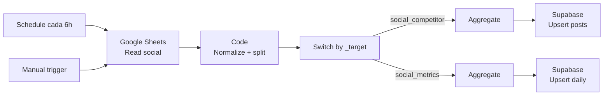

# Setup del workflow: Social Sheet Sync (Drean)

Workflow N8N que lee un Google Sheet con scraping de redes sociales y lo
escribe en Supabase (tabla `social_competitor` por post + `social_metrics`
agregado diario).

## Arquitectura

## Por qué dos targets

- **`social_competitor`**: una fila por post del Sheet. Útil para análisis
  individual (qué post tuvo más likes, qué pilar performó mejor).
- **`social_metrics`**: una fila por (fecha, plataforma, cuenta). Agregado
  diario para charts y KPIs en el dashboard.

El Code node genera AMBOS sets en una sola pasada y los routea por
`_target` con un nodo Switch.

## Pre-requisitos

- Migración aplicada: `supabase/migrations/0003_extend_social_schema.sql`
- Sheet de Drean con la estructura del scraper existente (17 columnas).
- Workflow de planning ya funcionando (mismo patrón de env vars / hardcode).

## Paso 1 — Aplicar la migración 0003 en Supabase

1. Abrí Supabase → **SQL Editor → New query**.
2. Pegá el contenido de `supabase/migrations/0003_extend_social_schema.sql`.
3. Run.
4. Verificá: en **Table Editor → social_competitor**, deberías ver las nuevas
   columnas (pilar, sentiment_positivo, sentiment_negativo, sentiment_neutro,
   content_type, sponsored, hashtags, tipo_post, insight).

## Paso 2 — Preparar el Sheet de Drean

El workflow espera un Sheet con esta estructura **exacta** (fila 1 = encabezados):

| Columna        | Ejemplo                        | Tipo        |
|----------------|--------------------------------|-------------|
| RED-SOCIAL     | `INSTAGRAM` / `FACEBOOK` / `TIKTOK` | Texto  |
| POSTEO         | `https://www.instagram.com/...` | URL        |
| PILAR          | `Producto` / `Branding` / `Educacional` / `Promo` | Texto |
| POSITIVO       | `80`                           | Número (%)  |
| NEGATIVO       | `10`                           | Número (%)  |
| NEUTRO         | `10`                           | Número (%)  |
| INSIGHT        | Texto descriptivo del post     | Texto       |
| LIKES          | `5266`                         | Número      |
| COMENTARIOS    | `218`                          | Número      |
| ENGAGEMENT     | `10.2%`                        | Número (%)  |
| DATE           | `2026-04-14`                   | Fecha       |
| TYPE           | `ORGÁNICO` / `PAUTA`           | Texto       |
| MARCA          | `dreanargentina` / `philco.arg` / `gafaargentina` | Texto |
| VIEWS          | `140214`                       | Número      |
| CONTENT_TYPE   | `SIDECAR` / `VIDEO` / `IMAGE`  | Texto       |
| SPONSORED      | `TRUE` / `FALSE`               | Boolean     |
| HASHTAGS       | `#drean #lavarropas`           | Texto       |
| FOLLOWERS      | `141335`                       | Número      |

> 💡 Si tu scraper actual ya genera estas 17 columnas (lo vimos en tu Sheet
> de Tombaio), simplemente clonalo y cambiá el **output** a un Sheet nuevo
> específico de Drean.

**Convención de `MARCA`**: usá el nombre tal cual aparece en la red
(`dreanargentina`, no `@dreanargentina` ni `Drean Argentina`). El workflow
detecta si es propia o competencia comparando contra `dreanargentina`.

## Paso 3 — Importar el workflow

1. Bajate `sheets-social-sync.json` desde el repo.
2. En N8N: **Workflows → Create → ⋮ → Import from File**.
3. Renombrá a **Sheets Social Sync (Drean)**.

## Paso 4 — Configurar el nodo Google Sheets

1. Doble-click en **"Google Sheets — Read social"**.
2. En **Credential**: seleccioná tu credencial de Google Sheets ya creada
   (no hay que crear otra, la misma del workflow de planning sirve).
3. En **Document**: si tu Sheet está en el mismo Drive, lo vas a ver en el
   dropdown. Seleccionalo. Si no, click **By ID** y pegá el ID del Sheet
   desde la URL.
4. En **Sheet**: seleccioná la pestaña con la data del scraping. Por
   default el JSON busca `RED-SOCIAL` — si tu pestaña se llama distinto,
   cambialo acá.

## Paso 5 — Hardcodear Supabase (igual que los workflows anteriores)

En los **dos nodos** de Supabase:

- **"Supabase — Upsert social_competitor"**
  - URL: `https://TU-PROJECT.supabase.co/rest/v1/social_competitor?on_conflict=plataforma,cuenta,post_id`
  - Headers: `apikey` = `sb_secret_...`, `Authorization` = `Bearer sb_secret_...`
- **"Supabase — Upsert social_metrics"**
  - URL: `https://TU-PROJECT.supabase.co/rest/v1/social_metrics?on_conflict=fecha,plataforma,cuenta`
  - Headers: igual.

## Paso 6 — Probar

1. **Manual trigger → Execute workflow**.
2. Vas a ver los nodos pasar a verde. El Switch va a abrir 2 ramas paralelas.
3. **Verificar en Supabase**:
   - **`social_competitor`**: una fila por post.
   - **`social_metrics`**: una fila por (fecha, plataforma, cuenta) con
     posts, likes, comentarios y sentiment promedio.
4. **Verificar en el dashboard**: abrí `/competitors` en Vercel. Deberías
   ver las 4 KPI cards con números, el chart de engagement por marca, el
   chart de pilar, y la tabla benchmark con Drean vs Philco vs Gafa.

## Paso 7 — Activar el schedule

Toggle a **Active**. Va a correr cada 6 horas.

## Troubleshooting

### `post_id` colisiona y nada se inserta
El workflow genera `post_id` deterministicamente a partir de (fecha + marca + url).
Si dos filas distintas terminan con el mismo hash (raro), el upsert sobreescribe.
Solución: agregá un campo único más al hash (ej: contenido) en el Code node.

### "Plataforma 'other'" en muchas filas
El workflow mapea `INSTAGRAM/FACEBOOK/TIKTOK` (mayúsculas). Si tu Sheet tiene
otros valores (ej: `Instagram` con caps mixtos), agregalos al mapa
`PLATAFORMA_MAP` en el Code node.

### Engagement_rate sale raro
Cada fila del Sheet tiene su engagement, pero al agregar por día tomamos el
**promedio**. Si necesitás otra agregación (suma, mediana), editá el Code node.

### Sentiment_promedio_* sale en null
Solo se agrega cuando las 3 columnas (POSITIVO, NEGATIVO, NEUTRO) están
presentes y son numéricas. Si tu Sheet tiene celdas vacías o textos, esas
filas se ignoran para el agregado.
